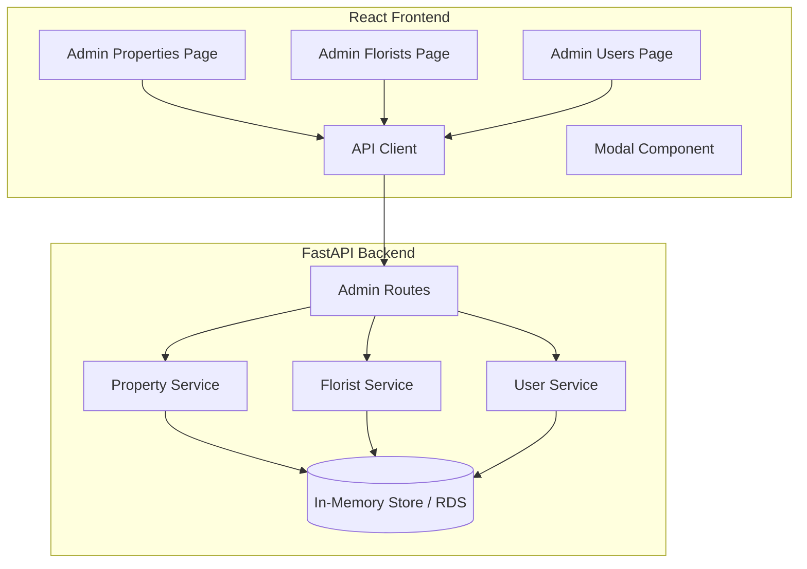

# Design Document: Admin CRUD UI

## Overview

This design implements a minimal Admin CRUD UI for managing Properties, Florists, and Users in the Bloom platform. The implementation follows the existing dashboard shell architecture, using React components with TypeScript, and integrates with the FastAPI backend via the existing API client.

The design prioritizes simplicity and speed-to-market per the MLP guidelines, using basic HTML tables and modals without external UI libraries.

**Note:** The Admin Users UI is backend-first—the new `/admin/users` endpoints (GET and POST) must be implemented before the Users page UI can be built.

## Non-Goals

The following are explicitly out of scope for this implementation:
- No edit or delete flows (create + list only)
- No pagination, search, or sorting
- No bulk actions
- No assignment management UI in this slice

## Architecture



## Components and Interfaces

### Frontend Components

#### 1. AdminTable Component
A reusable table component for displaying entity lists.

```typescript
interface Column<T> {
  key: keyof T;
  header: string;
  render?: (value: T[keyof T], row: T) => React.ReactNode;
}

interface AdminTableProps<T> {
  columns: Column<T>[];
  data: T[];
  loading: boolean;
  error: string | null;
}
```

#### 2. AddModal Component
A reusable modal component for creating new entities.

```typescript
interface FieldConfig {
  name: string;
  label: string;
  type: 'text' | 'email' | 'password' | 'select';
  required: boolean;
  options?: { value: string; label: string }[];
}

interface AddModalProps {
  title: string;
  fields: FieldConfig[];
  isOpen: boolean;
  onClose: () => void;
  onSubmit: (data: Record<string, string>) => Promise<void>;
  error: string | null;
}
```

#### 3. StatusDropdown Component
A dropdown for updating entity status inline.

```typescript
interface StatusDropdownProps {
  currentStatus: string;
  options: string[];
  onStatusChange: (newStatus: string) => Promise<void>;
  disabled?: boolean;
}
```

#### 4. Page Components
Each admin page follows the same pattern:

```typescript
// PropertiesPage.tsx
function PropertiesPage() {
  const [properties, setProperties] = useState<Property[]>([]);
  const [loading, setLoading] = useState(true);
  const [error, setError] = useState<string | null>(null);
  const [modalOpen, setModalOpen] = useState(false);
  
  // Fetch on mount
  // Handle add
  // Handle status update
  // Render table + modal
}
```

### Backend API Endpoints

#### Existing Endpoints (No Changes Required)
- `GET /admin/properties` - List all properties
- `POST /admin/properties` - Create property
- `PATCH /admin/properties/{id}` - Update property (including status)
- `GET /admin/florists` - List all florists
- `POST /admin/florists` - Create florist

#### New Endpoints Required

##### GET /admin/users
```python
@router.get("/users", response_model=List[UserResponse])
async def list_users(
    current_user: dict = Depends(require_role(["ADMIN"]))
):
    """List all users (ADMIN only)."""
    users = await get_all_users()
    return [UserResponse.model_validate(u) for u in users]
```

##### POST /admin/users
```python
class UserCreate(BaseModel):
    email: EmailStr
    role: UserRole
    password: str = Field(..., min_length=6)

@router.post("/users", response_model=UserResponse, status_code=201)
async def create_user(
    data: UserCreate,
    current_user: dict = Depends(require_role(["ADMIN"]))
):
    """Create a new user (ADMIN only)."""
    # Check for existing user
    # Hash password
    # Create user
    # Return response
```

## Data Models

### Frontend Types

```typescript
// Property type (matches API response)
interface Property {
  id: string;
  name: string;
  address: string;
  status: 'DRAFT' | 'SUBMITTED' | 'ACTIVE';
  delivery_cadence: string | null;
  created_at: string;
  updated_at: string;
}

// Florist type (matches API response)
interface Florist {
  id: string;
  name: string;
  status: 'ONBOARDING' | 'READY';
  created_at: string;
}

// User type (matches API response)
interface User {
  id: string;
  email: string;
  role: 'CUSTOMER' | 'PROPERTY_MANAGER' | 'FLORIST' | 'ADMIN';
  created_at: string;
}
```

### Backend Schemas

```python
# New schema for user creation
class UserCreate(BaseModel):
    email: EmailStr = Field(..., description="User email address")
    role: UserRole = Field(..., description="User role")
    password: str = Field(..., min_length=6, description="User password")

# Existing UserResponse is sufficient for list/create responses
```

## Correctness Properties

*A property is a characteristic or behavior that should hold true across all valid executions of a system—essentially, a formal statement about what the system should do. Properties serve as the bridge between human-readable specifications and machine-verifiable correctness guarantees.*

### Property 1: Entity Creation Round-Trip
*For any* valid entity creation request (property with name/address, florist with name, or user with email/role/password), after successful creation via POST, the entity SHALL appear in the subsequent GET list response with correct initial status (DRAFT for properties, ONBOARDING for florists).

**Validates: Requirements 1.4, 2.4, 3.4, 4.3**

### Property 2: Property Status Update Persistence
*For any* property and valid status value, after a successful PATCH request to update status, subsequent GET requests SHALL return the property with the updated status value.

**Validates: Requirements 1.5, 1.6**

### Property 3: User Authentication Round-Trip
*For any* valid user creation request (email, role, password), after successful creation, the user SHALL be able to authenticate using POST /auth/login with the same email and password, receiving a valid JWT token.

**Validates: Requirements 3.5, 4.2, 4.3**

### Property 4: Duplicate Email Rejection
*For any* email address that already exists in the system, a POST /admin/users request with that email SHALL return a 409 Conflict error and NOT create a duplicate user.

**Validates: Requirements 4.4**

### Property 5: API RBAC Enforcement
*For any* request to /admin/* endpoints that is either unauthenticated OR authenticated with a non-ADMIN role, the API SHALL return a 401 Unauthorized or 403 Forbidden error.

**Validates: Requirements 4.5, 5.4**

### Property 6: Error Message Display
*For any* API request that returns an error response with the standard error envelope format, the UI SHALL extract and display the error message from `error.message` to the user.

**Validates: Requirements 1.7, 2.5, 3.6**

## Error Handling

### Frontend Error Display
- API errors are captured from the standard error envelope
- Errors display inline near the triggering action (modal footer or table row)
- Errors clear when the user retries the action

```typescript
// Error display pattern
{error && (
  <div className="error-message" role="alert">
    {error}
  </div>
)}
```

### Backend Error Responses
All errors follow the existing error envelope format:

```json
{
  "error": {
    "code": "VALIDATION_ERROR",
    "message": "Email already exists"
  }
}
```

## Testing Strategy

### Unit Tests
- Test individual component rendering (table, modal, dropdown)
- Test form validation logic
- Test API client error handling
- Test specific examples and edge cases (empty lists, single items)

### Property-Based Tests
Property-based tests will use Hypothesis (Python) for backend to verify the correctness properties defined above. Each property test runs minimum 100 iterations.

**Backend (Hypothesis)**:
- **Property 1**: Generate random entity data (properties, florists, users), create via POST, verify appears in GET list
- **Property 2**: Generate random properties and valid status values, update via PATCH, verify in subsequent GET
- **Property 3**: Generate random user credentials, create user, verify can authenticate
- **Property 4**: Generate random emails, create user, attempt duplicate creation, verify 409
- **Property 5**: Generate random non-admin roles and tokens, attempt /admin/* access, verify rejection

**Test Tagging Format**: `Feature: admin-crud-ui, Property N: [property description]`

### Integration Tests
- End-to-end flow: Create entity → Verify in list → Update status → Verify update
- Authentication flow: Create user → Login as new user → Verify role access
