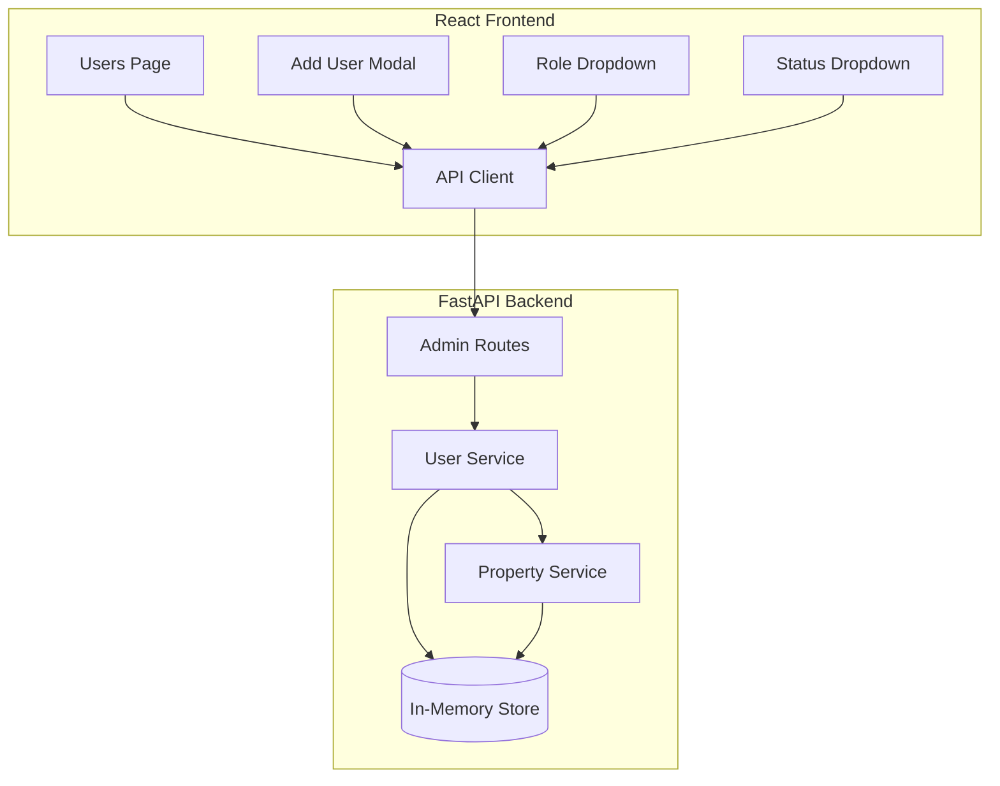

# Design Document: Admin Users Enhanced

## Overview

This design extends the existing Admin Users functionality with richer user metadata, property assignments for Property Managers, subscription status management for Customers, and a PATCH endpoint for updates. The implementation builds on the existing FastAPI backend and React frontend architecture.

The design follows the MLP guidelines: simplicity first, managed services, and speed to market.

## Architecture



## Components and Interfaces

### Backend API Endpoints

#### GET /admin/users (Enhanced)
Returns enriched user list with property_name for Property Managers.

```python
class EnrichedUserResponse(BaseModel):
    id: UUID
    email: EmailStr
    role: UserRole
    property_id: Optional[UUID] = None
    property_name: Optional[str] = None  # NEW: Resolved property name
    subscription_status: Optional[SubscriptionStatus] = None  # Nullable for non-CUSTOMER
    created_at: datetime
```

#### POST /admin/users (Enhanced)
Creates user with conditional field validation.

```python
class UserCreateEnhanced(BaseModel):
    email: EmailStr
    role: UserRole
    password: str = Field(..., min_length=6)
    property_id: Optional[UUID] = None  # Only valid for PROPERTY_MANAGER

# Validation rules:
# - If role != PROPERTY_MANAGER and property_id provided -> 400 error
# - If role == CUSTOMER -> subscription_status defaults to CREATED
# - If role != CUSTOMER -> subscription_status is None
```

#### PATCH /admin/users/{id} (New)
Updates user with role-aware field validation.

```python
class UserUpdate(BaseModel):
    role: Optional[UserRole] = None
    property_id: Optional[UUID] = None
    subscription_status: Optional[SubscriptionStatus] = None

# Validation rules:
# - subscription_status update requires role == CUSTOMER
# - property_id update requires role == PROPERTY_MANAGER
# - Role change clears invalid fields (e.g., property_id if role != PM)
```

### Frontend Components

#### Enhanced UsersPage
```typescript
// Columns: Email, Role, Property, Subscription Status, Created At
// Inline dropdowns for role and subscription_status updates
// Property column shows property_name (resolved from property_id)
```

#### Enhanced AddModal
```typescript
// Conditional field rendering:
// - Property selector: visible only when role === 'PROPERTY_MANAGER'
// - Subscription status: visible only when role === 'CUSTOMER' (read-only, defaults to CREATED)
```

### Shared Types

```typescript
// Enhanced AdminUser type
export interface AdminUser {
  id: string;
  email: string;
  role: UserRole;
  property_id: string | null;
  property_name: string | null;
  subscription_status: SubscriptionStatus | null;
  created_at: string;
}

// Enhanced CreateUserRequest
export interface CreateUserRequest {
  email: string;
  role: UserRole;
  password: string;
  property_id?: string;  // Only for PROPERTY_MANAGER
}

// New UpdateUserRequest
export interface UpdateUserRequest {
  role?: UserRole;
  property_id?: string | null;
  subscription_status?: SubscriptionStatus;
}
```

## Data Models

### User Model (Enhanced)
The existing User model already has the required fields:
- `id`, `email`, `hashed_password`, `role`, `property_id`, `subscription_status`, `created_at`

Key behaviors:
- `subscription_status` defaults to `CREATED` for all users currently
- Need to enforce: `subscription_status` is `None` for non-CUSTOMER users
- `property_id` should only be set for PROPERTY_MANAGER users

### Business Rules

1. **CUSTOMER users**: 
   - `subscription_status` must be one of: CREATED, ACTIVE, PAUSED
   - `property_id` should be null (customers don't manage properties)

2. **PROPERTY_MANAGER users**:
   - `subscription_status` must be null
   - `property_id` may reference a valid Property

3. **FLORIST/ADMIN users**:
   - `subscription_status` must be null
   - `property_id` must be null

4. **Property Status Recomputation**:
   - When a PM is assigned to a property, recompute property status
   - When a PM is removed from a property, recompute property status


## Correctness Properties

*A property is a characteristic or behavior that should hold true across all valid executions of a system—essentially, a formal statement about what the system should do. Properties serve as the bridge between human-readable specifications and machine-verifiable correctness guarantees.*

### Property 1: User Creation Round-Trip
*For any* valid user creation request (email, role, password, optional property_id), after successful creation via POST /admin/users, the user SHALL appear in the subsequent GET /admin/users response with matching email, role, and property_id.

**Validates: Requirements 8.1, 3.1, 3.2**

### Property 2: CUSTOMER Subscription Status Default
*For any* user created with role = CUSTOMER, the subscription_status SHALL be CREATED in the creation response and in subsequent GET requests.

**Validates: Requirements 1.2, 3.5**

### Property 3: Non-CUSTOMER Subscription Status Null
*For any* user created with role ≠ CUSTOMER (PROPERTY_MANAGER, FLORIST, ADMIN), the subscription_status SHALL be null in the creation response and in subsequent GET requests.

**Validates: Requirements 1.3**

### Property 4: Property ID Role Validation
*For any* user creation or update request:
- If role = PROPERTY_MANAGER, property_id MAY be a valid Property UUID or null
- If role ≠ PROPERTY_MANAGER and property_id is provided, the API SHALL return 400 Bad Request
- If property_id references a non-existent Property, the API SHALL return 400 Bad Request

**Validates: Requirements 1.4, 3.3, 3.4, 4.5**

### Property 5: Role Change Field Sanitization
*For any* user update that changes role, invalid fields SHALL be cleared:
- If new role ≠ PROPERTY_MANAGER, property_id SHALL become null
- If new role ≠ CUSTOMER, subscription_status SHALL become null
- If new role = CUSTOMER, subscription_status SHALL become CREATED

**Validates: Requirements 4.3, 6.3**

### Property 6: Subscription Status Update Validation
*For any* PATCH request that updates subscription_status, if the user's role ≠ CUSTOMER, the API SHALL return 400 Bad Request.

**Validates: Requirements 4.4**

### Property 7: Duplicate Email Rejection
*For any* email address that already exists in the system, a POST /admin/users request with that email SHALL return 409 Conflict and NOT create a duplicate user.

**Validates: Requirements 3.6**

### Property 8: RBAC Enforcement
*For any* request to /admin/users endpoints:
- Unauthenticated requests SHALL return 401 Unauthorized
- Authenticated requests with role ≠ ADMIN SHALL return 403 Forbidden
- Only ADMIN role SHALL successfully access these endpoints

**Validates: Requirements 2.3, 3.7, 4.6, 7.2, 7.3, 8.5**

### Property 9: Property Status Recomputation on PM Assignment
*For any* property, when a PROPERTY_MANAGER is assigned or removed via user update:
- If property gains a PM and has a florist, status SHALL become ACTIVE
- If property gains a PM and has no florist, status SHALL become PENDING_FLORIST
- If property loses its PM and has a florist, status SHALL become PENDING_PM
- If property loses its PM and has no florist, status SHALL become CREATED

**Validates: Requirements 6.1**

### Property 10: Error Envelope Format
*For any* API error response, the response body SHALL contain `{ "detail": "<message>" }` or the standard error envelope format, and the HTTP status code SHALL be appropriate (400, 401, 403, 404, 409).

**Validates: Requirements 9.1**

## Error Handling

### Backend Error Responses
All errors follow the existing error envelope format:

```json
{
  "detail": "Error message here"
}
```

Or for structured errors:
```json
{
  "error": {
    "code": "VALIDATION_ERROR",
    "message": "property_id is only valid for PROPERTY_MANAGER role"
  }
}
```

### Error Codes
- `400 Bad Request`: Invalid field combinations, validation failures
- `401 Unauthorized`: Missing or invalid authentication
- `403 Forbidden`: Authenticated but insufficient permissions
- `404 Not Found`: User or Property not found
- `409 Conflict`: Duplicate email

### Frontend Error Display
- API errors are captured from the response
- Errors display inline near the triggering action (modal footer or table row)
- Errors clear when the user retries the action or closes the modal

## Testing Strategy

### Unit Tests
- Test individual component rendering (table columns, modal fields)
- Test conditional field visibility based on role selection
- Test form validation logic
- Test API client error handling

### Property-Based Tests
Property-based tests will use Hypothesis (Python) for backend to verify the correctness properties defined above. Each property test runs minimum 100 iterations.

**Backend (Hypothesis)**:
- **Property 1**: Generate random valid user data, create via POST, verify in GET list
- **Property 2**: Generate random CUSTOMER users, verify subscription_status = CREATED
- **Property 3**: Generate random non-CUSTOMER users, verify subscription_status = null
- **Property 4**: Generate users with various role/property_id combinations, verify validation
- **Property 5**: Create users, change roles, verify field sanitization
- **Property 6**: Create non-CUSTOMER users, attempt subscription_status update, verify rejection
- **Property 7**: Create user, attempt duplicate, verify 409
- **Property 8**: Generate requests with various auth states, verify RBAC
- **Property 9**: Assign/remove PMs, verify property status recomputation
- **Property 10**: Trigger various errors, verify envelope format

**Test Tagging Format**: `Feature: admin-users-enhanced, Property N: [property description]`

### Integration Tests
- End-to-end flow: Create user → Verify in list → Update role → Verify changes
- PM assignment flow: Create PM → Assign to property → Verify property status
- Subscription flow: Create CUSTOMER → Update subscription_status → Verify in list
