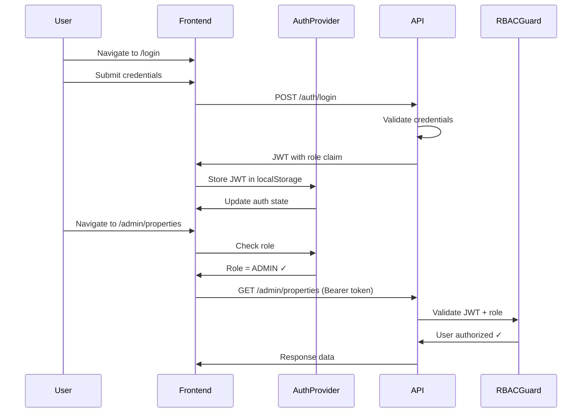

# Design Document: Authentication + Server-Side RBAC

## Overview

This design implements real authentication and server-enforced role-based access control (RBAC) for the Bloom platform. The system replaces the current UI-only role state with JWT-based authentication where roles are embedded in token claims and validated server-side on every request.

The architecture follows a stateless JWT pattern where:
1. Users authenticate via email/password to receive a signed JWT
2. The JWT contains role claims that the backend validates on each request
3. The frontend stores the JWT in localStorage and includes it in API requests
4. Both frontend and backend enforce role-based access, with the backend being the source of truth

## Architecture



## Components and Interfaces

### Backend Components

#### 1. User Model (`apps/api/models/user.py`)

```python
from enum import Enum
from datetime import datetime
from pydantic import BaseModel, EmailStr
from uuid import UUID, uuid4

class UserRole(str, Enum):
    CUSTOMER = "CUSTOMER"
    PROPERTY_MANAGER = "PROPERTY_MANAGER"
    FLORIST = "FLORIST"
    ADMIN = "ADMIN"

class User(BaseModel):
    id: UUID
    email: EmailStr
    hashed_password: str
    role: UserRole
    created_at: datetime

class UserResponse(BaseModel):
    id: UUID
    email: EmailStr
    role: UserRole
    created_at: datetime
```

#### 2. Auth Service (`apps/api/auth/service.py`)

```python
from datetime import datetime, timedelta, timezone
from jose import jwt, JWTError
from passlib.context import CryptContext
import os

class AuthService:
    def __init__(self):
        self.secret_key = os.environ["JWT_SECRET"]
        self.algorithm = "HS256"
        self.access_token_expire_minutes = 60 * 24  # 24 hours
        self.pwd_context = CryptContext(schemes=["bcrypt"])
    
    def create_access_token(self, user: User) -> str:
        now = datetime.now(timezone.utc)
        expire = now + timedelta(minutes=self.access_token_expire_minutes)
        payload = {
            "sub": str(user.id),
            "email": user.email,
            "role": user.role.value,
            "iss": "bloom-api",
            "aud": "bloom-web",
            "exp": int(expire.timestamp()),  # Explicit UNIX timestamp
            "iat": int(now.timestamp())       # Explicit UNIX timestamp
        }
        return jwt.encode(payload, self.secret_key, algorithm=self.algorithm)
    
    def verify_token(self, token: str) -> dict:
        # Allows 60 seconds clock skew
        return jwt.decode(
            token, 
            self.secret_key, 
            algorithms=[self.algorithm],
            audience="bloom-web",
            issuer="bloom-api",
            options={"leeway": 60}
        )
    
    def verify_password(self, plain: str, hashed: str) -> bool:
        return self.pwd_context.verify(plain, hashed)
    
    def hash_password(self, password: str) -> str:
        return self.pwd_context.hash(password)
```

#### 3. Auth Dependencies (`apps/api/auth/dependencies.py`)

```python
from fastapi import Depends, HTTPException
from fastapi.security import HTTPBearer, HTTPAuthorizationCredentials
from jose import JWTError
from uuid import uuid4
from typing import Callable
from .service import AuthService, auth_service

security = HTTPBearer()

async def get_current_user(
    credentials: HTTPAuthorizationCredentials = Depends(security),
) -> dict:
    """FastAPI dependency to extract and validate current user from JWT."""
    request_id = str(uuid4())
    try:
        payload = auth_service.verify_token(credentials.credentials)
        return {
            "id": payload["sub"],
            "email": payload["email"],
            "role": payload["role"]
        }
    except JWTError:
        raise HTTPException(
            status_code=401,
            detail={
                "error": {
                    "code": "INVALID_TOKEN",
                    "message": "Invalid or expired token",
                    "request_id": request_id
                }
            }
        )

def require_role(allowed_roles: list[str]) -> Callable:
    """Returns a FastAPI dependency that validates user role."""
    async def role_checker(
        current_user: dict = Depends(get_current_user)
    ) -> dict:
        request_id = str(uuid4())
        if current_user["role"] not in allowed_roles:
            raise HTTPException(
                status_code=403,
                detail={
                    "error": {
                        "code": "FORBIDDEN",
                        "message": f"Role {current_user['role']} not authorized for this resource",
                        "request_id": request_id
                    }
                }
            )
        return current_user
    return role_checker
```

#### 4. Global Exception Handler (`apps/api/middleware/exceptions.py`)

```python
from fastapi import Request, HTTPException
from fastapi.responses import JSONResponse
from uuid import uuid4

async def http_exception_handler(request: Request, exc: HTTPException):
    """Ensures all HTTP exceptions follow the standard error envelope format."""
    # If detail is already in our format, use it
    if isinstance(exc.detail, dict) and "error" in exc.detail:
        return JSONResponse(
            status_code=exc.status_code,
            content=exc.detail
        )
    
    # Otherwise, wrap in standard format
    return JSONResponse(
        status_code=exc.status_code,
        content={
            "error": {
                "code": "HTTP_ERROR",
                "message": str(exc.detail),
                "request_id": str(uuid4())
            }
        }
    )

# Register in main.py:
# app.add_exception_handler(HTTPException, http_exception_handler)
```

#### 5. Auth Routes (`apps/api/routes/auth.py`)

```python
from fastapi import APIRouter, HTTPException, Depends
from pydantic import BaseModel, EmailStr
from auth.dependencies import get_current_user
from auth.service import auth_service
from models.user import UserResponse

router = APIRouter(prefix="/auth", tags=["auth"])

class LoginRequest(BaseModel):
    email: EmailStr
    password: str

class LoginResponse(BaseModel):
    access_token: str
    token_type: str = "bearer"
    user: UserResponse  # Include user in response for redirect

@router.post("/login", response_model=LoginResponse)
async def login(request: LoginRequest):
    """Authenticate user and return JWT with user info."""
    user = await get_user_by_email(request.email)
    if not user or not auth_service.verify_password(request.password, user.hashed_password):
        raise HTTPException(
            status_code=401,
            detail={
                "error": {
                    "code": "INVALID_CREDENTIALS",
                    "message": "Invalid email or password",
                    "request_id": str(uuid4())
                }
            }
        )
    
    access_token = auth_service.create_access_token(user)
    return LoginResponse(
        access_token=access_token,
        user=UserResponse(id=user.id, email=user.email, role=user.role, created_at=user.created_at)
    )

@router.get("/me", response_model=UserResponse)
async def get_me(current_user: dict = Depends(get_current_user)):
    """Return current authenticated user."""
    return current_user
```

#### 6. Dev Role Switch Endpoint (`apps/api/routes/auth.py` - dev only)

```python
import os

# Only available in development
if os.environ.get("ENVIRONMENT") == "development":
    class DevSwitchRoleRequest(BaseModel):
        role: str
    
    @router.post("/dev/switch-role", response_model=LoginResponse)
    async def dev_switch_role(request: DevSwitchRoleRequest):
        """Dev-only endpoint to get JWT for a specific role."""
        # Find the seeded user for this role
        user = await get_user_by_role(request.role)
        if not user:
            raise HTTPException(status_code=404, detail="No user found for role")
        
        access_token = auth_service.create_access_token(user)
        return LoginResponse(
            access_token=access_token,
            user=UserResponse(id=user.id, email=user.email, role=user.role, created_at=user.created_at)
        )
```

#### 7. Protected Route Example (`apps/api/routes/admin.py`)

```python
from fastapi import APIRouter, Depends
from auth.dependencies import require_role

router = APIRouter(prefix="/admin", tags=["admin"])

@router.get("/ping")
async def admin_ping(current_user: dict = Depends(require_role(["ADMIN"]))):
    """Test endpoint - ADMIN only."""
    return {"ok": True, "role": current_user["role"]}
```

#### 8. CORS Configuration (`apps/api/main.py`)

```python
import os
from fastapi import FastAPI, HTTPException
from fastapi.middleware.cors import CORSMiddleware
from middleware.exceptions import http_exception_handler

app = FastAPI(title="Bloom API", version="0.1.0")

# Register global exception handler for consistent error format
app.add_exception_handler(HTTPException, http_exception_handler)

# CORS configuration
allowed_origins = [
    "http://localhost:5173",
    "http://127.0.0.1:5173",
]

# Add production domain if configured
if prod_domain := os.environ.get("WEB_DOMAIN"):
    allowed_origins.append(prod_domain)

app.add_middleware(
    CORSMiddleware,
    allow_origins=allowed_origins,
    allow_credentials=False,  # MLP: credentials=false
    allow_methods=["*"],
    allow_headers=["*", "Authorization"],  # Explicitly allow Authorization
)
```

### Frontend Components

#### 1. Auth Types (`packages/shared/src/types/auth.ts`)

```typescript
import { UserRole } from './roles';

export interface User {
  id: string;
  email: string;
  role: UserRole;
}

export interface AuthState {
  user: User | null;
  isAuthenticated: boolean;
  isLoading: boolean;
}

export interface LoginCredentials {
  email: string;
  password: string;
}

export interface LoginResponse {
  access_token: string;
  token_type: string;
  user: User;
}

export interface AuthError {
  code: string;
  message: string;
  request_id: string;
}
```

#### 2. API Client (`apps/web/src/lib/api.ts`)

```typescript
const API_BASE_URL = import.meta.env.VITE_API_BASE_URL || 'http://localhost:8000';

export async function apiRequest<T>(
  endpoint: string,
  options: RequestInit = {}
): Promise<T> {
  const token = localStorage.getItem('bloom_auth_token');
  
  const headers: HeadersInit = {
    'Content-Type': 'application/json',
    ...options.headers,
  };
  
  if (token) {
    headers['Authorization'] = `Bearer ${token}`;
  }
  
  const response = await fetch(`${API_BASE_URL}${endpoint}`, {
    ...options,
    headers,
  });
  
  if (!response.ok) {
    const error = await response.json();
    throw new Error(error.error?.message || 'Request failed');
  }
  
  return response.json();
}
```

#### 3. Auth Context (`apps/web/src/providers/AuthProvider.tsx`)

```typescript
import { createContext, useContext, useState, useEffect, ReactNode } from 'react';
import { User, AuthState, LoginCredentials, LoginResponse } from '@bloom/shared';
import { apiRequest } from '@/lib/api';

interface AuthContextType extends AuthState {
  login: (credentials: LoginCredentials) => Promise<User>;
  logout: () => void;
}

const AuthContext = createContext<AuthContextType | null>(null);

const TOKEN_KEY = 'bloom_auth_token';

export function AuthProvider({ children }: { children: ReactNode }) {
  const [state, setState] = useState<AuthState>({
    user: null,
    isAuthenticated: false,
    isLoading: true,
  });

  // Restore auth state on mount
  useEffect(() => {
    const token = localStorage.getItem(TOKEN_KEY);
    if (token) {
      fetchCurrentUser();
    } else {
      setState(s => ({ ...s, isLoading: false }));
    }
  }, []);

  const fetchCurrentUser = async () => {
    try {
      const user = await apiRequest<User>('/auth/me');
      setState({ user, isAuthenticated: true, isLoading: false });
    } catch {
      localStorage.removeItem(TOKEN_KEY);
      setState({ user: null, isAuthenticated: false, isLoading: false });
    }
  };

  const login = async (credentials: LoginCredentials): Promise<User> => {
    const response = await apiRequest<LoginResponse>('/auth/login', {
      method: 'POST',
      body: JSON.stringify(credentials),
    });
    
    localStorage.setItem(TOKEN_KEY, response.access_token);
    setState({ user: response.user, isAuthenticated: true, isLoading: false });
    
    // Return user for immediate redirect (avoids race condition)
    return response.user;
  };

  const logout = () => {
    localStorage.removeItem(TOKEN_KEY);
    setState({ user: null, isAuthenticated: false, isLoading: false });
  };

  return (
    <AuthContext.Provider value={{ ...state, login, logout }}>
      {children}
    </AuthContext.Provider>
  );
}

export function useAuth() {
  const context = useContext(AuthContext);
  if (!context) throw new Error('useAuth must be used within AuthProvider');
  return context;
}
```

#### 4. Protected Route Guard (`apps/web/src/router/ProtectedRoute.tsx`)

```typescript
import { Navigate, useLocation } from 'react-router-dom';
import { useAuth } from '@/providers/AuthProvider';
import { UserRole } from '@bloom/shared';
import { getDefaultPath } from '@/config/sidebarConfig';

interface ProtectedRouteProps {
  children: React.ReactNode;
  allowedRoles?: UserRole[];
}

export function ProtectedRoute({ children, allowedRoles }: ProtectedRouteProps) {
  const { user, isAuthenticated, isLoading } = useAuth();
  const location = useLocation();

  if (isLoading) {
    return <LoadingSpinner />;
  }

  if (!isAuthenticated) {
    return <Navigate to="/login" state={{ from: location }} replace />;
  }

  if (allowedRoles && user && !allowedRoles.includes(user.role)) {
    return <Navigate to={getDefaultPath(user.role)} replace />;
  }

  return <>{children}</>;
}
```

#### 5. Login Page (`apps/web/src/pages/LoginPage.tsx`)

```typescript
import { useState } from 'react';
import { useNavigate, useLocation } from 'react-router-dom';
import { useAuth } from '@/providers/AuthProvider';
import { getDefaultPath } from '@/config/sidebarConfig';

export function LoginPage() {
  const [email, setEmail] = useState('');
  const [password, setPassword] = useState('');
  const [error, setError] = useState('');
  const [isSubmitting, setIsSubmitting] = useState(false);
  
  const { login } = useAuth();
  const navigate = useNavigate();
  const location = useLocation();

  const handleSubmit = async (e: React.FormEvent) => {
    e.preventDefault();
    setError('');
    setIsSubmitting(true);
    
    try {
      // login() returns the user, avoiding stale state race condition
      const user = await login({ email, password });
      const from = location.state?.from?.pathname || getDefaultPath(user.role);
      navigate(from, { replace: true });
    } catch (err) {
      setError(err instanceof Error ? err.message : 'Login failed');
    } finally {
      setIsSubmitting(false);
    }
  };

  return (
    <form onSubmit={handleSubmit}>
      {/* Email input, password input, submit button, error display */}
    </form>
  );
}
```

#### 6. Dev Role Switcher (`apps/web/src/components/RoleSwitcher.tsx`)

```typescript
import { UserRole, ALL_ROLES } from '@bloom/shared';
import { useAuth } from '@/providers/AuthProvider';
import { apiRequest } from '@/lib/api';

const TOKEN_KEY = 'bloom_auth_token';

export function RoleSwitcher() {
  const { user, login } = useAuth();
  
  // Only show in development
  if (import.meta.env.PROD) return null;

  const handleRoleChange = async (role: UserRole) => {
    try {
      // Get new JWT from backend dev endpoint
      const response = await apiRequest<{ access_token: string; user: User }>(
        '/auth/dev/switch-role',
        {
          method: 'POST',
          body: JSON.stringify({ role }),
        }
      );
      
      // Store new token and update state
      localStorage.setItem(TOKEN_KEY, response.access_token);
      window.location.reload(); // Reload to reset all state
    } catch (err) {
      console.error('Failed to switch role:', err);
    }
  };

  return (
    <select
      value={user?.role}
      onChange={(e) => handleRoleChange(e.target.value as UserRole)}
    >
      {ALL_ROLES.map((role) => (
        <option key={role} value={role}>{role}</option>
      ))}
    </select>
  );
}
```

## Data Models

### JWT Payload Structure

```json
{
  "sub": "550e8400-e29b-41d4-a716-446655440000",
  "email": "admin@bloom.test",
  "role": "ADMIN",
  "iss": "bloom-api",
  "aud": "bloom-web",
  "exp": 1735430400,
  "iat": 1735344000
}
```

### Error Response Structure

```json
{
  "error": {
    "code": "FORBIDDEN",
    "message": "Role CUSTOMER not authorized for this resource",
    "request_id": "a1b2c3d4-e5f6-7890-abcd-ef1234567890"
  }
}
```

### Dev Seed Users

| Email | Password | Role |
|-------|----------|------|
| admin@bloom.test | bloom123 | ADMIN |
| florist@bloom.test | bloom123 | FLORIST |
| pm@bloom.test | bloom123 | PROPERTY_MANAGER |
| customer@bloom.test | bloom123 | CUSTOMER |


## Correctness Properties

*A property is a characteristic or behavior that should hold true across all valid executions of a system—essentially, a formal statement about what the system should do. Properties serve as the bridge between human-readable specifications and machine-verifiable correctness guarantees.*

### Property 1: JWT Contains Required Claims

*For any* successful login with valid credentials, the returned JWT SHALL contain all required claims: sub (user id), email, role, iss ("bloom-api"), aud ("bloom-web"), exp (expiration), and iat (issued at).

**Validates: Requirements 1.1, 2.2**

### Property 2: Auth/Me Round-Trip Consistency

*For any* user who successfully logs in, calling GET /auth/me with the returned JWT SHALL return a user object with the same id, email, and role as encoded in the JWT claims.

**Validates: Requirements 1.3**

### Property 3: RBAC Role-Route Access Matrix

*For any* authenticated user and any protected route namespace, access SHALL be granted if and only if the user's role matches the route's required role:
- /admin/** requires ADMIN
- /florist/** requires FLORIST  
- /pm/** requires PROPERTY_MANAGER
- /customer/** requires CUSTOMER

When access is denied, the system SHALL return a 403 Forbidden response.

**Validates: Requirements 3.1, 3.2, 3.3, 3.4, 3.5**

### Property 4: Unauthenticated Request Rejection

*For any* protected route and any request without a valid Authorization header, the system SHALL return a 401 Unauthorized response.

**Validates: Requirements 3.6, 1.4**

### Property 5: Error Response Format Consistency

*For any* authentication or authorization error (401 or 403), the response body SHALL follow the standard error format containing: error.code (string), error.message (string), and error.request_id (UUID string).

**Validates: Requirements 3.1.1, 3.1.2, 3.1.3**

### Property 6: Frontend Route Guard Behavior

*For any* navigation attempt to a protected route:
- If unauthenticated → redirect to /login
- If authenticated but wrong role → redirect to user's role landing page
- If authenticated with correct role → render the page

**Validates: Requirements 5.1, 5.2, 5.3**

### Property 7: Login Flow Correctness

*For any* login form submission:
- If credentials are valid → store JWT, redirect to role's landing page
- If credentials are invalid → display error message, remain on login page

**Validates: Requirements 6.3, 6.4, 1.2**

### Property 8: Auth State Persistence Round-Trip

*For any* successful login, the auth state stored in localStorage SHALL be correctly restored on page refresh, preserving the user's id, email, and role.

**Validates: Requirements 10.1, 10.2**

### Property 9: Logout Clears All Auth State

*For any* logout action, the system SHALL clear the JWT from localStorage AND reset the AuthProvider state to unauthenticated.

**Validates: Requirements 4.4**

### Property 10: Invalid Credentials Return 401

*For any* login attempt with invalid email or password, the system SHALL return a 401 Unauthorized response with the standard error format.

**Validates: Requirements 1.2**

## Error Handling

### Backend Error Codes

| Code | HTTP Status | Description |
|------|-------------|-------------|
| `INVALID_CREDENTIALS` | 401 | Email or password is incorrect |
| `INVALID_TOKEN` | 401 | JWT is missing, expired, or malformed |
| `TOKEN_EXPIRED` | 401 | JWT has expired |
| `FORBIDDEN` | 403 | User's role not authorized for resource |
| `USER_NOT_FOUND` | 404 | User does not exist |

### Frontend Error Handling

1. **Network Errors**: Display generic "Unable to connect" message
2. **401 Errors**: Clear auth state, redirect to login
3. **403 Errors**: Redirect to unauthorized page or role's landing page
4. **Validation Errors**: Display field-specific error messages

### Error Response Examples

```json
// 401 - Invalid credentials
{
  "error": {
    "code": "INVALID_CREDENTIALS",
    "message": "Invalid email or password",
    "request_id": "a1b2c3d4-e5f6-7890-abcd-ef1234567890"
  }
}

// 403 - Forbidden
{
  "error": {
    "code": "FORBIDDEN",
    "message": "Role CUSTOMER not authorized for /admin/properties",
    "request_id": "b2c3d4e5-f6a7-8901-bcde-f12345678901"
  }
}
```

## Testing Strategy

### Backend Testing (pytest)

**Unit Tests:**
- Auth service: password hashing, JWT creation/verification
- RBAC guard: role validation logic
- Error response formatting

**Property-Based Tests (Hypothesis):**
- Property 1: JWT claims validation
- Property 2: Auth/me round-trip
- Property 3: RBAC role-route matrix
- Property 4: Unauthenticated rejection
- Property 5: Error response format
- Property 10: Invalid credentials handling

**Integration Tests:**
- Full login flow with database
- Protected route access with real JWT
- CORS configuration validation

### Frontend Testing (Vitest + React Testing Library)

**Unit Tests:**
- AuthProvider state management
- Login form validation
- Route guard logic

**Property-Based Tests (fast-check):**
- Property 6: Route guard behavior
- Property 7: Login flow correctness
- Property 8: Auth persistence round-trip
- Property 9: Logout state clearing

**Integration Tests:**
- Full login/logout flow
- Route protection with mocked API
- Auth state persistence across refresh

### Test Configuration

- Backend: pytest with hypothesis, minimum 100 iterations per property
- Frontend: vitest with fast-check, minimum 100 iterations per property
- Each property test tagged with: `Feature: auth-rbac, Property N: <property_text>`
