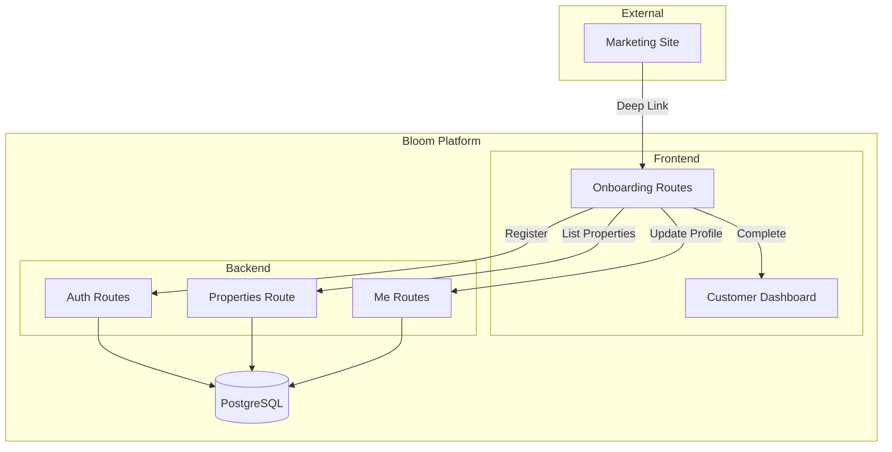
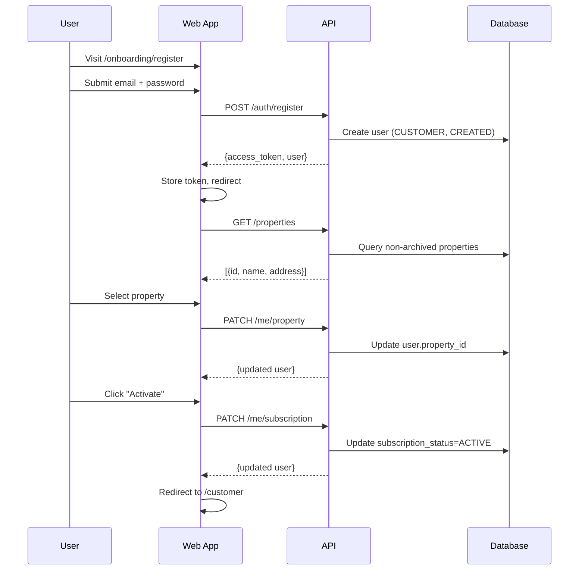

# Design Document: Customer Onboarding Flow

## Overview

This design specifies the implementation of a self-service customer onboarding flow for the Bloom platform. The flow enables new customers to register, select their apartment property, configure their subscription, and access their dashboard without admin intervention.

The implementation spans:
- **Backend**: New public and customer-authenticated API endpoints
- **Frontend**: New onboarding route namespace with smart navigation guards
- **Shared**: TypeScript types and API client methods

## Architecture

### System Context



### Request Flow



## Components and Interfaces

### Backend Components

#### 1. Registration Endpoint (`POST /auth/register`)

**Location**: `apps/api/routes/auth.py`

```python
class RegisterRequest(BaseModel):
    email: EmailStr
    password: str = Field(..., min_length=6)

class RegisterResponse(BaseModel):
    access_token: str
    token_type: str = "bearer"
    user: UserResponse

@router.post("/register", response_model=RegisterResponse, status_code=201)
async def register(request: RegisterRequest):
    # 1. Check for existing user (409 if exists)
    # 2. Hash password
    # 3. Create user with role=CUSTOMER, subscription_status=CREATED
    # 4. Generate JWT
    # 5. Return token + user
```

#### 2. Public Properties Endpoint (`GET /properties`)

**Location**: `apps/api/routes/properties.py` (new file)

```python
class PropertyListItem(BaseModel):
    id: UUID
    name: str
    address: str

@router.get("/properties", response_model=List[PropertyListItem])
async def list_properties_public(db: Session = Depends(get_db)):
    # Return non-archived properties with minimal fields
```

#### 3. Me Routes (`/me/*`)

**Location**: `apps/api/routes/me.py` (new file)

```python
class MePropertyUpdate(BaseModel):
    property_id: UUID

class MeSubscriptionUpdate(BaseModel):
    subscription_status: SubscriptionStatus  # Only ACTIVE or PAUSED

@router.patch("/me/property", response_model=UserResponse)
async def update_my_property(
    data: MePropertyUpdate,
    current_user: dict = Depends(require_role(["CUSTOMER"]))
):
    # Validate property exists and not archived
    # Update user.property_id
    # Return updated user

@router.patch("/me/subscription", response_model=UserResponse)
async def update_my_subscription(
    data: MeSubscriptionUpdate,
    current_user: dict = Depends(require_role(["CUSTOMER"]))
):
    # Validate status is ACTIVE or PAUSED (not CREATED)
    # Update user.subscription_status
    # Return updated user
```

### Frontend Components

#### 1. Onboarding Router Guard

**Location**: `apps/web/src/router/OnboardingGuard.tsx`

```typescript
function OnboardingGuard({ children }: { children: ReactNode }) {
  const { user, isAuthenticated, isLoading } = useAuth();
  const location = useLocation();
  
  if (isLoading) return <LoadingSpinner />;
  
  // Unauthenticated: only allow /onboarding/register
  if (!isAuthenticated) {
    if (location.pathname !== '/onboarding/register') {
      return <Navigate to="/onboarding/register" />;
    }
    return children;
  }
  
  // Non-CUSTOMER: redirect to role landing
  if (user.role !== 'CUSTOMER') {
    return <Navigate to={getRoleLandingPage(user.role)} />;
  }
  
  // CUSTOMER routing based on state
  if (!user.property_id) {
    if (location.pathname !== '/onboarding/property') {
      return <Navigate to="/onboarding/property" />;
    }
  } else if (user.subscription_status === 'CREATED') {
    if (location.pathname !== '/onboarding/subscription') {
      return <Navigate to="/onboarding/subscription" />;
    }
  } else {
    // ACTIVE or PAUSED - redirect to dashboard
    return <Navigate to="/customer" />;
  }
  
  return children;
}
```

#### 2. Progress Header Component

**Location**: `apps/web/src/components/OnboardingProgress.tsx`

```typescript
interface OnboardingProgressProps {
  currentStep: 1 | 2 | 3;
}

function OnboardingProgress({ currentStep }: OnboardingProgressProps) {
  const steps = ['Register', 'Select Property', 'Activate'];
  return (
    <div className="onboarding-progress">
      <span>Step {currentStep} of 3</span>
      {/* Visual step indicators */}
    </div>
  );
}
```

#### 3. Onboarding Pages

**Registration Page** (`apps/web/src/pages/onboarding/RegisterPage.tsx`):
- Email and password form
- Parse `?email=` and `?property_id=` from URL
- Store property_id in sessionStorage for later use
- On success: store token, redirect to `/onboarding/property`

**Property Selection Page** (`apps/web/src/pages/onboarding/PropertyPage.tsx`):
- Fetch properties from `GET /properties`
- Searchable/filterable list
- Check sessionStorage for pre-selected property_id
- On select: call `PATCH /me/property`, redirect to `/onboarding/subscription`

**Subscription Page** (`apps/web/src/pages/onboarding/SubscriptionPage.tsx`):
- Display property summary
- "Activate Subscription" button
- On click: call `PATCH /me/subscription` with status=ACTIVE
- On success: redirect to `/customer`

### API Client Extensions

**Location**: `apps/web/src/lib/api.ts`

```typescript
// New API methods
export async function register(data: RegisterRequest): Promise<RegisterResponse> {
  return apiRequest('/auth/register', { method: 'POST', body: JSON.stringify(data) });
}

export async function listProperties(): Promise<PropertyListItem[]> {
  return apiRequest('/properties');
}

export async function updateMyProperty(data: MePropertyUpdateRequest): Promise<User> {
  return apiRequest('/me/property', { method: 'PATCH', body: JSON.stringify(data) });
}

export async function updateMySubscription(data: MeSubscriptionUpdateRequest): Promise<User> {
  return apiRequest('/me/subscription', { method: 'PATCH', body: JSON.stringify(data) });
}
```

## Data Models

### User Model (Existing - No Changes)

The existing User model already supports all required fields:

```python
class User(BaseModel):
    id: UUID
    email: EmailStr
    hashed_password: str
    role: UserRole           # CUSTOMER for onboarding users
    status: UserStatus       # ACTIVE by default
    property_id: Optional[UUID]  # Set during onboarding step 2
    subscription_status: SubscriptionStatus  # CREATED → ACTIVE
    created_at: datetime
```

### New Request/Response Schemas

```python
# Registration
class RegisterRequest(BaseModel):
    email: EmailStr
    password: str = Field(..., min_length=6)

class RegisterResponse(BaseModel):
    access_token: str
    token_type: str = "bearer"
    user: UserResponse

# Public property list item
class PropertyListItem(BaseModel):
    id: UUID
    name: str
    address: str

# Me endpoint requests
class MePropertyUpdate(BaseModel):
    property_id: UUID

class MeSubscriptionUpdate(BaseModel):
    subscription_status: SubscriptionStatus  # Validated to exclude CREATED
```

### TypeScript Types

```typescript
// Registration
interface RegisterRequest {
  email: string;
  password: string;
}

interface RegisterResponse {
  access_token: string;
  token_type: string;
  user: User;
}

// Property list
interface PropertyListItem {
  id: string;
  name: string;
  address: string;
}

// Me endpoint requests
interface MePropertyUpdateRequest {
  property_id: string;
}

interface MeSubscriptionUpdateRequest {
  subscription_status: 'ACTIVE' | 'PAUSED';
}
```


## Correctness Properties

*A property is a characteristic or behavior that should hold true across all valid executions of a system—essentially, a formal statement about what the system should do. Properties serve as the bridge between human-readable specifications and machine-verifiable correctness guarantees.*

Based on the prework analysis, the following properties have been identified for property-based testing:

### Property 1: Registration creates CUSTOMER with correct defaults

*For any* valid email and password combination, registering via `POST /auth/register` SHALL create a user with role=CUSTOMER, subscription_status=CREATED, property_id=null, and return a response containing access_token, token_type="bearer", and a user object with these fields.

**Validates: Requirements 1.2, 1.3**

### Property 2: Registration rejects invalid email formats

*For any* string that is not a valid email format, submitting it to `POST /auth/register` SHALL return HTTP 422 with validation error details.

**Validates: Requirements 1.5**

### Property 3: Property list returns correct format excluding archived

*For any* set of properties in the database, `GET /properties` SHALL return only non-ARCHIVED properties, and each returned item SHALL contain exactly id, name, and address fields.

**Validates: Requirements 2.2, 2.3**

### Property 4: Non-CUSTOMER roles get 403 on /me/* endpoints

*For any* user with role other than CUSTOMER (ADMIN, PROPERTY_MANAGER, FLORIST), calling `PATCH /me/property` or `PATCH /me/subscription` SHALL return HTTP 403.

**Validates: Requirements 3.3, 4.3**

### Property 5: Property assignment round-trip

*For any* valid property_id belonging to a non-ARCHIVED property, calling `PATCH /me/property` with that property_id SHALL update the user's property_id and return a user object where property_id equals the submitted value.

**Validates: Requirements 3.4**

### Property 6: Subscription update round-trip

*For any* subscription_status in {ACTIVE, PAUSED}, calling `PATCH /me/subscription` with that status SHALL update the user's subscription_status and return a user object where subscription_status equals the submitted value.

**Validates: Requirements 4.4, 4.6**

### Property 7: Subscription endpoint rejects CREATED status

*For any* attempt to set subscription_status to CREATED via `PATCH /me/subscription`, the endpoint SHALL return HTTP 400.

**Validates: Requirements 4.5**

### Property 8: Error responses follow Error_Envelope format

*For any* error response from onboarding endpoints (400, 401, 403, 409, 422), the response body SHALL contain an `error` object with `code`, `message`, and `request_id` fields.

**Validates: Requirements 12.1, 12.2**

### Property 9: Property search filter returns matching results

*For any* search query string, the property filter function SHALL return only properties whose name or address contains the query string (case-insensitive).

**Validates: Requirements 8.2**

## Error Handling

### Backend Error Responses

All endpoints follow the existing Error_Envelope pattern:

```python
{
    "error": {
        "code": "ERROR_CODE",
        "message": "Human-readable message",
        "request_id": "uuid-string"
    }
}
```

| Endpoint | Error Code | HTTP Status | Condition |
|----------|------------|-------------|-----------|
| POST /auth/register | EMAIL_EXISTS | 409 | Duplicate email |
| POST /auth/register | VALIDATION_ERROR | 422 | Invalid email format |
| PATCH /me/property | INVALID_PROPERTY | 400 | Property not found or archived |
| PATCH /me/property | FORBIDDEN | 403 | Non-CUSTOMER role |
| PATCH /me/subscription | INVALID_STATUS | 400 | Status is CREATED or invalid |
| PATCH /me/subscription | FORBIDDEN | 403 | Non-CUSTOMER role |

### Frontend Error Handling

- Display error messages from API responses in user-friendly format
- Maintain form state on error (don't clear inputs)
- Provide retry capability for transient errors
- Log errors to console for debugging

## Testing Strategy

### Property-Based Testing

**Framework**: Hypothesis (Python) for backend property tests

**Configuration**:
- Minimum 100 iterations per property test
- Use `@settings(max_examples=100)` decorator
- Tag each test with property reference

**Property Test Files**:
- `apps/api/tests/test_registration_properties.py` - Properties 1, 2
- `apps/api/tests/test_properties_list_properties.py` - Property 3
- `apps/api/tests/test_me_endpoints_properties.py` - Properties 4, 5, 6, 7, 8

### Unit Tests

**Backend Unit Tests**:
- Registration creates user with correct defaults
- Duplicate email returns 409
- Invalid email returns 422
- Public properties endpoint accessible without auth
- /me/property rejects non-CUSTOMER roles
- /me/property rejects invalid/archived property_id
- /me/subscription rejects non-CUSTOMER roles
- /me/subscription rejects CREATED status
- /me/subscription accepts ACTIVE and PAUSED

**Frontend Unit Tests** (minimal):
- Query parameter parsing for email and property_id
- Property filter function logic

### Integration Tests

**End-to-End Flow Test**:
1. Register new user → verify CUSTOMER with CREATED status
2. List properties → verify non-empty list
3. Assign property → verify user.property_id updated
4. Activate subscription → verify user.subscription_status = ACTIVE
5. Access /customer/ping → verify 200 OK

### Test Annotations

Each property test must include:
```python
# Feature: customer-onboarding-flow, Property N: [property description]
# Validates: Requirements X.Y
```
