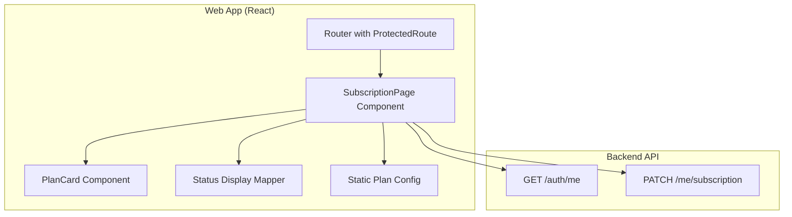

# Design Document: Customer Subscriptions Page

## Overview

The Customer Subscriptions Page provides a dedicated interface for customers to manage their floral subscription. The page displays available plans as visual cards, shows the current subscription status with friendly language (never exposing internal status values like "CREATED"), and enables subscription actions including activation, pause, resume, and plan switching.

The design prioritizes:
- **User-friendly status mapping**: Internal states are translated to customer-friendly language
- **Card-based plan comparison**: Visual cards make it easy to compare plans
- **Contextual actions**: Buttons change based on subscription state
- **Error resilience**: Clear feedback for loading and error states

## Architecture



### Data Flow

1. User navigates to `/customer/subscription`
2. `ProtectedRoute` validates authentication and CUSTOMER role
3. `SubscriptionPage` fetches user data via `getMe()`
4. `StatusMapper` converts internal status to friendly display
5. `PlanCard` components render based on `PlanConfig` and current status
6. User actions trigger API calls via `updateMySubscription()`
7. UI updates based on API response or displays error

## Components and Interfaces

### SubscriptionPage Component

The main page component that orchestrates data fetching, state management, and rendering.

```typescript
interface SubscriptionPageState {
  userData: MeResponse | null;
  isLoading: boolean;
  isActionLoading: boolean;
  error: string | null;
  selectedPlanId: string | null;
}
```

**Responsibilities:**
- Fetch user data on mount
- Manage loading and error states
- Handle subscription actions (activate, pause, resume, switch)
- Render page header with status-appropriate subheader
- Render plan cards grid

### PlanCard Component

A reusable card component for displaying a single subscription plan.

```typescript
interface PlanCardProps {
  plan: PlanConfig;
  isCurrentPlan: boolean;
  subscriptionStatus: SubscriptionStatus | null;
  onAction: (action: PlanAction) => void;
  isLoading: boolean;
}

type PlanAction = 
  | { type: 'activate'; planId: string }
  | { type: 'pause' }
  | { type: 'resume' }
  | { type: 'switch'; planId: string };
```

**Responsibilities:**
- Display plan name, cadence, and features
- Show visual highlight for current plan
- Render contextual action button based on status
- Disable button during loading

### Status Display Mapper

Utility functions for mapping internal status to customer-friendly display.

```typescript
interface StatusDisplay {
  showPill: boolean;
  pillText: string | null;
  pillColor: string | null;
  subheader: string;
}

function getStatusDisplay(status: SubscriptionStatus | null): StatusDisplay {
  switch (status) {
    case 'CREATED':
    case null:
      return {
        showPill: false,
        pillText: null,
        pillColor: null,
        subheader: 'Choose a plan to get started.',
      };
    case 'ACTIVE':
      return {
        showPill: true,
        pillText: 'Active',
        pillColor: 'bg-green-100 text-green-800',
        subheader: 'Your subscription is active.',
      };
    case 'PAUSED':
      return {
        showPill: true,
        pillText: 'Paused',
        pillColor: 'bg-yellow-100 text-yellow-800',
        subheader: 'Your subscription is paused.',
      };
  }
}
```

### Action Button Logic

```typescript
function getActionButton(
  status: SubscriptionStatus | null,
  isCurrentPlan: boolean
): { label: string; action: string } | null {
  if (status === 'CREATED' || status === null) {
    return { label: 'Activate this plan', action: 'activate' };
  }
  
  if (status === 'ACTIVE') {
    if (isCurrentPlan) {
      return { label: 'Pause subscription', action: 'pause' };
    }
    return { label: 'Switch to this plan', action: 'switch' };
  }
  
  if (status === 'PAUSED') {
    if (isCurrentPlan) {
      return { label: 'Resume subscription', action: 'resume' };
    }
    return { label: 'Switch to this plan', action: 'switch' };
  }
  
  return null;
}
```

## Data Models

### Plan Configuration (Static)

```typescript
interface PlanConfig {
  id: string;
  name: string;
  cadence: string;
  cadenceLabel: string;
  features: string[];
  price?: string; // Optional, placeholder for v1
}

const SUBSCRIPTION_PLANS: PlanConfig[] = [
  {
    id: 'starter',
    name: 'Starter',
    cadence: 'every_4_weeks',
    cadenceLabel: 'Every 4 weeks',
    features: [
      'Fresh seasonal flowers',
      'Standard arrangement',
      'Delivery to your door',
    ],
  },
  {
    id: 'standard',
    name: 'Standard',
    cadence: 'every_2_weeks',
    cadenceLabel: 'Every 2 weeks',
    features: [
      'Fresh seasonal flowers',
      'Premium arrangement',
      'Delivery to your door',
      'Vase included',
    ],
  },
  {
    id: 'premium',
    name: 'Premium',
    cadence: 'weekly',
    cadenceLabel: 'Weekly',
    features: [
      'Fresh seasonal flowers',
      'Luxury arrangement',
      'Priority delivery',
      'Premium vase included',
      'Care instructions card',
    ],
  },
];
```

### Selected Plan Storage (v1 Fallback)

For v1, if the backend doesn't have a `subscription_plan` field, store selection in localStorage:

```typescript
const SELECTED_PLAN_KEY = 'bloom_selected_plan';

function getSelectedPlan(): string | null {
  return localStorage.getItem(SELECTED_PLAN_KEY);
}

function setSelectedPlan(planId: string): void {
  localStorage.setItem(SELECTED_PLAN_KEY, planId);
  console.log('TODO: Persist subscription_plan to backend when field is available');
}
```

## Correctness Properties

*A property is a characteristic or behavior that should hold true across all valid executions of a system—essentially, a formal statement about what the system should do. Properties serve as the bridge between human-readable specifications and machine-verifiable correctness guarantees.*

### Property 1: Non-Customer Role Redirect

*For any* authenticated user with a non-CUSTOMER role (ADMIN, PROPERTY_MANAGER, FLORIST), navigating to `/customer/subscription` should redirect them to their role-specific landing page.

**Validates: Requirements 1.2**

### Property 2: CREATED Status Never Displayed

*For any* rendered state of the SubscriptionPage when subscription_status equals `CREATED`, the literal string "CREATED" should not appear anywhere in the rendered output.

**Validates: Requirements 2.1**

### Property 3: Title Always Displayed

*For any* subscription status (CREATED, ACTIVE, PAUSED, or null), the page title "Subscription" should always be displayed.

**Validates: Requirements 2.5**

### Property 4: Plan Cards Contain Required Information

*For any* plan in the SUBSCRIPTION_PLANS configuration, the rendered PlanCard should contain the plan's name, cadence label, and all features from the configuration.

**Validates: Requirements 3.2, 3.3, 3.4, 4.2**

### Property 5: Correct Action Buttons Based on Status

*For any* combination of subscription status and plan card (current vs non-current), the action button displayed should match the expected button for that state:
- CREATED + any plan → "Activate this plan"
- ACTIVE + current plan → "Pause subscription"
- ACTIVE + non-current plan → "Switch to this plan"
- PAUSED + current plan → "Resume subscription"
- PAUSED + non-current plan → "Switch to this plan"

**Validates: Requirements 5.1, 7.1, 7.2**

### Property 6: API Request Handling

*For any* API request (activation, pause, resume, switch), the relevant action button should be disabled while the request is in flight, and if the request fails, the error message from the Error_Envelope should be displayed.

**Validates: Requirements 8.3, 8.4**

## Error Handling

### API Error Display

Errors from API calls are displayed inline near the action that triggered them:

```typescript
{error && (
  <div className="mt-4 p-3 bg-red-50 border border-red-200 rounded-md">
    <p className="text-sm text-red-700">{error}</p>
  </div>
)}
```

### Loading States

1. **Initial Load**: Full-page loading skeleton while `getMe()` is in progress
2. **Action Loading**: Button shows loading state and is disabled during API calls
3. **Error Recovery**: User can retry actions after errors

### Error Scenarios

| Scenario | User Feedback |
|----------|---------------|
| `getMe()` fails | Error message with retry option |
| Activation fails | Inline error near plan cards |
| Pause/Resume fails | Inline error near current plan card |
| Network error | Generic "Request failed" message |

## Testing Strategy

### Unit Tests

1. **Status Display Mapper Tests**
   - Test `getStatusDisplay()` returns correct values for each status
   - Verify CREATED status never produces "CREATED" text
   - Test null status handling

2. **Action Button Logic Tests**
   - Test `getActionButton()` for all status/plan combinations
   - Verify correct button labels and actions

3. **Plan Configuration Tests**
   - Verify SUBSCRIPTION_PLANS has exactly 3 plans
   - Verify each plan has required fields

### Property-Based Tests

Property-based tests will use **Vitest** with **fast-check** for property testing.

Each property test should run minimum 100 iterations.

1. **Property 2 Test**: Generate random MeResponse with CREATED status, render page, verify "CREATED" not in output
2. **Property 4 Test**: For each plan config, render PlanCard, verify all config data appears in output
3. **Property 5 Test**: Generate random status/plan combinations, verify correct button is rendered

### Integration Tests

1. **Activation Flow**: Mock API, click activate, verify API called with correct payload, verify redirect
2. **Pause/Resume Flow**: Mock API, test pause then resume, verify UI updates
3. **Error Handling**: Mock API failure, verify error message displayed

### Test Configuration

```typescript
// vitest.config.ts additions for property testing
import { defineConfig } from 'vitest/config';

export default defineConfig({
  test: {
    // ... existing config
    testTimeout: 30000, // Allow time for property tests
  },
});
```
