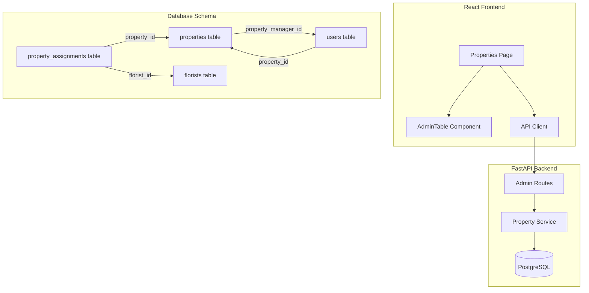
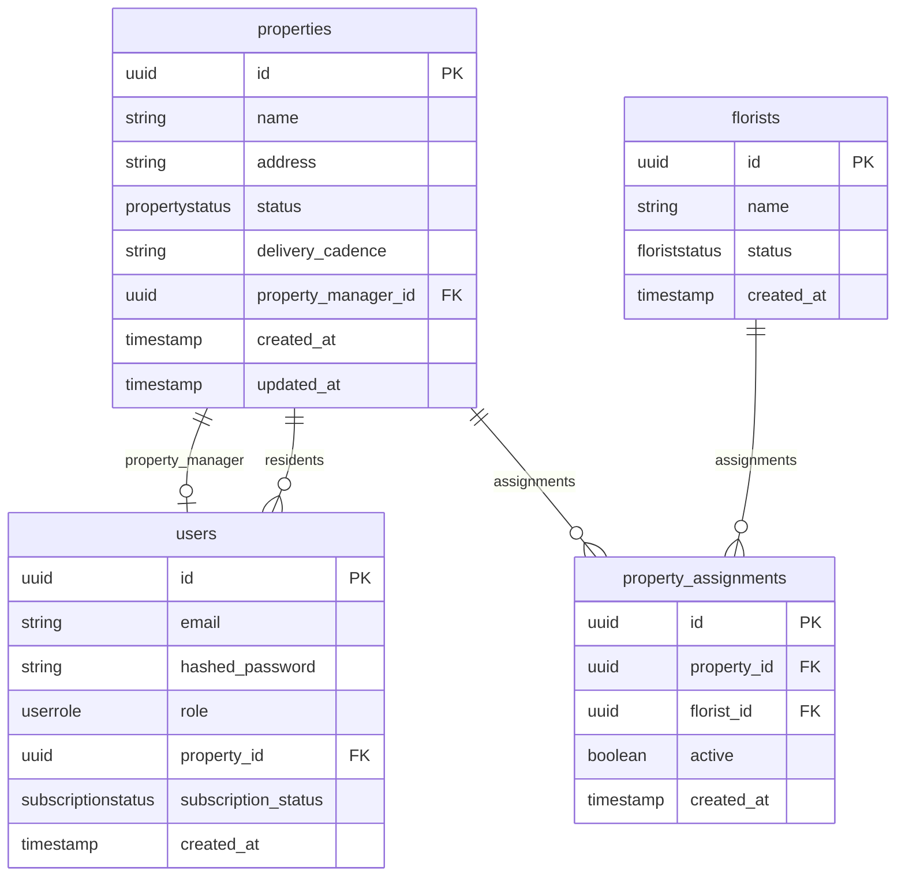

# Design Document: Enhanced Properties Table

## Overview

This design enhances the Admin Properties table to display comprehensive property information including user counts, florist assignments, property manager assignments, and automatic status computation. The implementation extends the existing FastAPI backend and React frontend, adding new database fields, computed properties, and UI columns.

The design follows the MLP guidelines, prioritizing simplicity and speed-to-market while providing admins with actionable property readiness information.

## Architecture



## Components and Interfaces

### Database Schema Changes

#### 1. Properties Table Enhancement

Add `property_manager_id` foreign key to properties table:

```sql
ALTER TABLE properties 
ADD COLUMN property_manager_id UUID REFERENCES users(id) ON DELETE SET NULL;
```

#### 2. Users Table Enhancement

Add `property_id` and `subscription_status` to users table:

```sql
-- Add property association
ALTER TABLE users 
ADD COLUMN property_id UUID REFERENCES properties(id) ON DELETE SET NULL;

-- Add subscription status
CREATE TYPE subscriptionstatus AS ENUM ('CREATED', 'ACTIVE', 'PAUSED');
ALTER TABLE users 
ADD COLUMN subscription_status subscriptionstatus DEFAULT 'CREATED';
```

#### 3. Property Status Enum Update

Update the property status enum to new values:

```sql
-- Create new enum type
CREATE TYPE propertystatus_v2 AS ENUM ('CREATED', 'PENDING_FLORIST', 'PENDING_PM', 'ACTIVE');

-- Migrate existing data (DRAFT -> CREATED, SUBMITTED -> CREATED, ACTIVE -> ACTIVE)
ALTER TABLE properties 
ALTER COLUMN status TYPE propertystatus_v2 
USING CASE 
    WHEN status = 'ACTIVE' THEN 'ACTIVE'::propertystatus_v2
    ELSE 'CREATED'::propertystatus_v2
END;
```

### Backend Components

#### 1. Updated Property Model

```python
class PropertyStatus(str, Enum):
    """Property lifecycle status - computed based on assignments."""
    CREATED = "CREATED"           # No florist, no PM
    PENDING_FLORIST = "PENDING_FLORIST"  # Has PM, needs florist
    PENDING_PM = "PENDING_PM"     # Has florist, needs PM
    ACTIVE = "ACTIVE"             # Has both florist and PM

class Property(Base):
    __tablename__ = "properties"
    
    id = Column(UUID, primary_key=True)
    name = Column(String(255), nullable=False)
    address = Column(String(500), nullable=False)
    status = Column(SQLEnum(PropertyStatus), default=PropertyStatus.CREATED)
    delivery_cadence = Column(String(100), nullable=True)
    property_manager_id = Column(UUID, ForeignKey("users.id"), nullable=True)
    created_at = Column(DateTime(timezone=True))
    updated_at = Column(DateTime(timezone=True))
    
    # Relationships
    property_manager = relationship("User", foreign_keys=[property_manager_id])
    assignments = relationship("PropertyAssignment", back_populates="property")
```

#### 2. User Subscription Status

```python
class SubscriptionStatus(str, Enum):
    """User subscription lifecycle status."""
    CREATED = "CREATED"   # Account created, no subscription
    ACTIVE = "ACTIVE"     # Active subscription
    PAUSED = "PAUSED"     # Subscription paused
```

#### 3. Enriched Property Response Schema

```python
class EnrichedPropertyResponse(BaseModel):
    """Enhanced property response with computed fields."""
    id: UUID
    name: str
    address: str
    status: PropertyStatus
    delivery_cadence: Optional[str]
    total_users: int
    active_users: int
    florist_name: Optional[str]
    property_manager_email: Optional[str]
    created_at: datetime
    updated_at: datetime
    
    model_config = {"from_attributes": True}
```

#### 4. Property Service - Status Computation

```python
def compute_property_status(
    has_florist: bool, 
    has_pm: bool
) -> PropertyStatus:
    """
    Compute property status based on assignments.
    
    Rules:
    - No florist + No PM -> CREATED
    - Florist + No PM -> PENDING_PM
    - No Florist + PM -> PENDING_FLORIST
    - Florist + PM -> ACTIVE
    """
    if has_florist and has_pm:
        return PropertyStatus.ACTIVE
    elif has_florist:
        return PropertyStatus.PENDING_PM
    elif has_pm:
        return PropertyStatus.PENDING_FLORIST
    else:
        return PropertyStatus.CREATED
```

#### 5. Enhanced List Properties Endpoint

```python
@router.get("/properties", response_model=List[EnrichedPropertyResponse])
async def list_properties(
    db: Session = Depends(get_db),
    current_user: dict = Depends(require_role(["ADMIN"]))
):
    """
    List all properties with enriched data.
    
    Returns computed fields:
    - total_users: Count of users with this property_id
    - active_users: Count of users with ACTIVE subscription
    - florist_name: Name of assigned florist (from active assignment)
    - property_manager_email: Email of assigned PM
    """
    return property_service.get_enriched_properties(db)
```

#### 6. Assign Property Manager Endpoint

```python
class AssignPMRequest(BaseModel):
    user_id: UUID

@router.patch("/properties/{property_id}/assign-pm")
async def assign_property_manager(
    property_id: UUID,
    data: AssignPMRequest,
    db: Session = Depends(get_db),
    current_user: dict = Depends(require_role(["ADMIN"]))
):
    """
    Assign a property manager to a property.
    
    Validates user has PROPERTY_MANAGER role.
    Automatically recomputes property status.
    """
    return property_service.assign_property_manager(db, property_id, data.user_id)
```

### Frontend Components

#### 1. Updated Property Type

```typescript
interface EnrichedProperty {
  id: string;
  name: string;
  address: string;
  status: 'CREATED' | 'PENDING_FLORIST' | 'PENDING_PM' | 'ACTIVE';
  delivery_cadence: string | null;
  total_users: number;
  active_users: number;
  florist_name: string | null;
  property_manager_email: string | null;
  created_at: string;
  updated_at: string;
}
```

#### 2. Status Display Mapping

```typescript
const STATUS_LABELS: Record<string, string> = {
  CREATED: 'Created',
  PENDING_FLORIST: 'Pending - Needs Florist',
  PENDING_PM: 'Pending - Needs PM',
  ACTIVE: 'Active',
};

const STATUS_COLORS: Record<string, string> = {
  CREATED: 'bg-gray-100 text-gray-800',
  PENDING_FLORIST: 'bg-yellow-100 text-yellow-800',
  PENDING_PM: 'bg-orange-100 text-orange-800',
  ACTIVE: 'bg-green-100 text-green-800',
};
```

#### 3. Enhanced Properties Page Columns

```typescript
const columns: Column<EnrichedProperty>[] = [
  { key: 'name', header: 'Name' },
  { key: 'address', header: 'Address' },
  { 
    key: 'total_users', 
    header: 'Total Users',
    render: (value) => value ?? 0
  },
  { 
    key: 'active_users', 
    header: 'Active Users',
    render: (value) => value ?? 0
  },
  { 
    key: 'florist_name', 
    header: 'Florist Assigned',
    render: (value) => value || '—'
  },
  { 
    key: 'property_manager_email', 
    header: 'Property Manager',
    render: (value) => value || '—'
  },
  {
    key: 'status',
    header: 'Status',
    render: (value) => (
      <span className={`px-2 py-1 rounded-full text-xs ${STATUS_COLORS[value]}`}>
        {STATUS_LABELS[value]}
      </span>
    ),
  },
  {
    key: 'updated_at',
    header: 'Updated',
    render: (value) => new Date(value).toLocaleDateString(),
  },
];
```

## Data Models

### Database ERD



## Correctness Properties

*A property is a characteristic or behavior that should hold true across all valid executions of a system—essentially, a formal statement about what the system should do. Properties serve as the bridge between human-readable specifications and machine-verifiable correctness guarantees.*


### Property 1: Status Computation Correctness

*For any* property with a given florist assignment state (has_florist: boolean) and property manager assignment state (has_pm: boolean), the computed status SHALL be:
- CREATED when has_florist=false AND has_pm=false
- PENDING_PM when has_florist=true AND has_pm=false
- PENDING_FLORIST when has_florist=false AND has_pm=true
- ACTIVE when has_florist=true AND has_pm=true

**Validates: Requirements 1.3, 1.4, 1.5, 8.1, 8.2, 8.3, 8.4**

### Property 2: Total Users Count Accuracy

*For any* property with N users associated via property_id, the total_users field in the enriched response SHALL equal N.

**Validates: Requirements 3.2, 6.2**

### Property 3: Active Users Count Accuracy

*For any* property with users associated via property_id, the active_users field SHALL equal the count of users where subscription_status = ACTIVE.

**Validates: Requirements 3.3, 6.3**

### Property 4: Florist Name Resolution

*For any* property with an active florist assignment, the florist_name field SHALL equal the name of the assigned florist. For properties without an active assignment, florist_name SHALL be null.

**Validates: Requirements 4.1, 6.4**

### Property 5: Property Manager Email Resolution

*For any* property with a property_manager_id set, the property_manager_email field SHALL equal the email of the referenced user. For properties without a PM, property_manager_email SHALL be null.

**Validates: Requirements 5.2, 6.5**

### Property 6: PM Role Validation

*For any* user without PROPERTY_MANAGER role, attempting to assign them as a property manager SHALL return a 400 Bad Request error and NOT modify the property.

**Validates: Requirements 7.3, 7.4**

### Property 7: New Property Default Status

*For any* newly created property (before any assignments), the status SHALL be CREATED.

**Validates: Requirements 1.2**

### Property 8: New User Default Subscription Status

*For any* newly created user, the subscription_status SHALL default to CREATED.

**Validates: Requirements 2.2**

### Property 9: Status Recomputation on Assignment Change

*For any* property, when a florist assignment or property manager assignment changes, the property status SHALL be recomputed to reflect the new assignment state.

**Validates: Requirements 8.5**

## Error Handling

### API Error Responses

All errors follow the existing error envelope format:

```json
{
  "error": {
    "code": "ERROR_CODE",
    "message": "Human-readable error message",
    "request_id": "uuid"
  }
}
```

#### Error Codes

| Code | HTTP Status | Description |
|------|-------------|-------------|
| NOT_FOUND | 404 | Property or user not found |
| INVALID_ROLE | 400 | User does not have PROPERTY_MANAGER role |
| VALIDATION_ERROR | 400 | Invalid request data |

### Frontend Error Display

- API errors display inline near the triggering action
- Errors clear when the user retries the action
- Network errors show a generic "Failed to load" message

## Testing Strategy

### Unit Tests

- Test status computation function with all 4 combinations of has_florist/has_pm
- Test status label mapping for all status values
- Test user count aggregation logic
- Test PM role validation

### Property-Based Tests

Property-based tests will use Hypothesis (Python) for backend. Each property test runs minimum 100 iterations.

**Test Configuration:**
- Framework: Hypothesis
- Minimum iterations: 100 per property
- Tag format: `Feature: enhanced-properties-table, Property N: [property description]`

**Backend Property Tests:**

1. **Property 1 Test**: Generate random boolean pairs (has_florist, has_pm), verify status computation matches expected value
2. **Property 2 Test**: Generate random properties with random user counts, verify total_users matches actual count
3. **Property 3 Test**: Generate random properties with users having random subscription statuses, verify active_users matches count of ACTIVE users
4. **Property 4 Test**: Generate random properties with/without florist assignments, verify florist_name resolution
5. **Property 5 Test**: Generate random properties with/without PM assignments, verify property_manager_email resolution
6. **Property 6 Test**: Generate random users with non-PM roles, attempt assignment, verify 400 error
7. **Property 7 Test**: Generate random property creation requests, verify initial status is CREATED
8. **Property 8 Test**: Generate random user creation requests, verify initial subscription_status is CREATED
9. **Property 9 Test**: Generate random properties, change assignments, verify status recomputes correctly

### Integration Tests

- End-to-end flow: Create property → Assign florist → Verify status → Assign PM → Verify ACTIVE status
- User association flow: Create users with property_id → List properties → Verify counts
