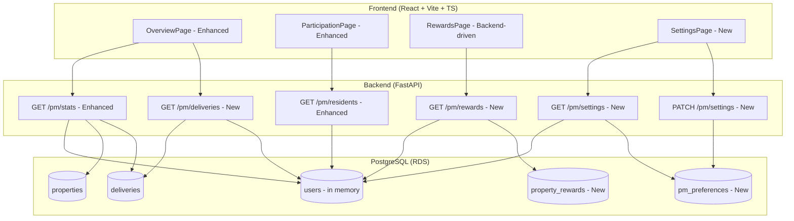

# Design Document: PM Dashboard V2

## Overview

This design enhances the existing Property Manager dashboard from a basic stats/resident-list view into a production-ready experience with delivery visibility, participation insights, backend-persisted rewards, and profile management. The design builds on the existing `GET /pm/stats` and `GET /pm/residents` endpoints and frontend pages, extending them with new data and adding new endpoints for deliveries, rewards, and settings.

The approach follows the MLP principle: enhance existing patterns rather than rebuild, use the existing SQLAlchemy/Alembic stack for new tables, and keep the monolithic API structure.

## Architecture

The PM Dashboard V2 extends the existing architecture with three new backend endpoints and a new database table for rewards persistence. All new endpoints follow the same pattern as existing PM routes: JWT-authenticated, PROPERTY_MANAGER role-required, data scoped to the PM's assigned property.



## Components and Interfaces

### Backend Endpoints

#### 1. Enhanced `GET /pm/stats` Response

Extends the existing `PMStatsResponse` with delivery-related fields. No new endpoint needed — the existing endpoint gains additional fields.

```python
class PMStatsResponse(BaseModel):
    # Existing fields
    property: PMPropertyInfo | None = None
    total_residents: int = 0
    active_subscriptions: int = 0
    paused_subscriptions: int = 0
    pending_activations: int = 0
    # New fields
    next_delivery_date: datetime | None = None
    upcoming_delivery_count: int = 0
    participation_rate: float = 0.0
```

The endpoint queries the `deliveries` table for the PM's property to find the next scheduled delivery date and count of upcoming (SCHEDULED status, future date) deliveries.

#### 2. Enhanced `GET /pm/residents` Response

Extends the existing response with plan distribution summary.

```python
class PlanDistribution(BaseModel):
    essential: int = 0
    signature: int = 0
    statement: int = 0

class PMResidentsResponse(BaseModel):
    # Existing fields
    property_name: str | None = None
    residents: list[ResidentInfo] = []
    # New fields
    plan_distribution: PlanDistribution = PlanDistribution()
```

#### 3. New `GET /pm/deliveries` Endpoint

Returns paginated delivery history for the PM's property with optional status filtering.

```python
# Query parameters
class PMDeliveriesParams:
    status: DeliveryStatus | None = None  # Optional filter
    page: int = 1
    page_size: int = 20

# Response
class PMDeliveryItem(BaseModel):
    id: UUID
    resident_email: str
    unit: str | None
    subscription_plan: SubscriptionPlan
    status: DeliveryStatus
    scheduled_for: datetime
    delivered_at: datetime | None

class DeliverySummary(BaseModel):
    delivered: int = 0
    skipped: int = 0
    missed: int = 0
    scheduled: int = 0

class PMDeliveriesResponse(BaseModel):
    deliveries: list[PMDeliveryItem] = []
    summary: DeliverySummary = DeliverySummary()
    total: int = 0
    page: int = 1
    page_size: int = 20
```

The endpoint:
- Queries `deliveries` table filtered by `property_id` matching the PM's assigned property
- Joins with user data to get `resident_email` and `unit`
- Computes `summary` from the last 90 days of deliveries
- Supports pagination via `page` and `page_size` query params
- Supports optional `status` filter query param

#### 4. New `GET /pm/rewards` Endpoint

Returns the current rewards tier computed from participation rate, persisted to the database.

```python
class RewardTierInfo(BaseModel):
    tier: str  # "Bronze", "Silver", "Gold"
    participation_rate: float
    benefits: list[str]
    next_tier: str | None  # None if already Gold
    progress_to_next: float  # 0.0 to 1.0
    threshold_for_next: int | None  # e.g., 50, 75

class PMRewardsResponse(BaseModel):
    current: RewardTierInfo
    tier_definitions: list[TierDefinition]

class TierDefinition(BaseModel):
    name: str
    min_rate: int
    max_rate: int | None
    benefits: list[str]
```

Tier computation logic:
- Bronze: 0-49% participation → lobby arrangements monthly, quarterly showcase
- Silver: 50-74% → all Bronze + bi-weekly arrangements, holiday specials
- Gold: 75%+ → all Silver + weekly arrangements, priority florist matching, newsletter feature

The endpoint:
1. Computes current participation rate from user data
2. Determines tier from rate
3. Upserts the `property_rewards` record with current tier and rate
4. Returns tier info with benefits and progress

#### 5. New `GET /pm/settings` and `PATCH /pm/settings` Endpoints

```python
class PMSettingsResponse(BaseModel):
    email: str
    property_name: str | None
    property_address: str | None
    notifications: NotificationPreferences

class NotificationPreferences(BaseModel):
    delivery_reminders: bool = True
    participation_updates: bool = True
    rewards_milestones: bool = True

class PMSettingsUpdate(BaseModel):
    notifications: NotificationPreferences
```

`GET /pm/settings` returns the PM's profile info (read-only) and notification preferences.
`PATCH /pm/settings` updates notification preferences only. Profile info (email, property) is managed elsewhere.

### Frontend Components

#### Enhanced OverviewPage
- Adds a "Next Delivery" card showing date and count of upcoming deliveries
- Adds a "Delivery Summary" section showing delivered/skipped/missed counts for last 90 days
- Keeps existing property info card and stats grid
- Adds participation rate as a computed field from stats

#### Enhanced ParticipationPage
- Adds plan distribution summary cards (Essential/Signature/Statement counts)
- Adds client-side sorting for the resident table (by unit, status, plan)
- Keeps existing filter tabs

#### Backend-Driven RewardsPage
- Replaces client-side tier computation with data from `GET /pm/rewards`
- Keeps existing tier card and benefits display UI
- Progress bar driven by `progress_to_next` from API

#### New SettingsPage
- Profile section (read-only): email, property name, property address
- Notification preferences section: toggle switches for each preference
- Save button with optimistic UI update and error rollback

## Data Models

### New Table: `property_rewards`

```sql
CREATE TABLE property_rewards (
    id UUID PRIMARY KEY DEFAULT gen_random_uuid(),
    property_id UUID NOT NULL REFERENCES properties(id),
    tier VARCHAR(10) NOT NULL DEFAULT 'Bronze',
    participation_rate NUMERIC(5,2) NOT NULL DEFAULT 0.0,
    updated_at TIMESTAMP WITH TIME ZONE NOT NULL DEFAULT NOW(),
    created_at TIMESTAMP WITH TIME ZONE NOT NULL DEFAULT NOW(),
    UNIQUE(property_id)
);
```

SQLAlchemy model:

```python
class PropertyReward(Base):
    __tablename__ = "property_rewards"

    id = Column(UUID(as_uuid=True), primary_key=True, default=uuid.uuid4)
    property_id = Column(UUID(as_uuid=True), ForeignKey("properties.id"), nullable=False, unique=True)
    tier = Column(String(10), nullable=False, default="Bronze")
    participation_rate = Column(Numeric(5, 2), nullable=False, default=0.0)
    updated_at = Column(DateTime(timezone=True), default=lambda: datetime.now(timezone.utc), onupdate=lambda: datetime.now(timezone.utc))
    created_at = Column(DateTime(timezone=True), default=lambda: datetime.now(timezone.utc))
```

### New Table: `pm_preferences`

```sql
CREATE TABLE pm_preferences (
    id UUID PRIMARY KEY DEFAULT gen_random_uuid(),
    user_id UUID NOT NULL UNIQUE,
    delivery_reminders BOOLEAN NOT NULL DEFAULT TRUE,
    participation_updates BOOLEAN NOT NULL DEFAULT TRUE,
    rewards_milestones BOOLEAN NOT NULL DEFAULT TRUE,
    created_at TIMESTAMP WITH TIME ZONE NOT NULL DEFAULT NOW(),
    updated_at TIMESTAMP WITH TIME ZONE NOT NULL DEFAULT NOW()
);
```

SQLAlchemy model:

```python
class PMPreference(Base):
    __tablename__ = "pm_preferences"

    id = Column(UUID(as_uuid=True), primary_key=True, default=uuid.uuid4)
    user_id = Column(UUID(as_uuid=True), nullable=False, unique=True)
    delivery_reminders = Column(Boolean, nullable=False, default=True)
    participation_updates = Column(Boolean, nullable=False, default=True)
    rewards_milestones = Column(Boolean, nullable=False, default=True)
    created_at = Column(DateTime(timezone=True), default=lambda: datetime.now(timezone.utc))
    updated_at = Column(DateTime(timezone=True), default=lambda: datetime.now(timezone.utc), onupdate=lambda: datetime.now(timezone.utc))
```

### Tier Computation Logic (Pure Function)

```python
def compute_reward_tier(participation_rate: float) -> str:
    if participation_rate >= 75.0:
        return "Gold"
    elif participation_rate >= 50.0:
        return "Silver"
    return "Bronze"

def compute_participation_rate(active: int, total: int) -> float:
    if total == 0:
        return 0.0
    return round((active / total) * 100, 2)
```

These are pure functions with no side effects, making them straightforward to test.


## Correctness Properties

*A property is a characteristic or behavior that should hold true across all valid executions of a system — essentially, a formal statement about what the system should do. Properties serve as the bridge between human-readable specifications and machine-verifiable correctness guarantees.*

### Property 1: Upcoming delivery stats are accurate

*For any* property with a set of deliveries (some scheduled in the future, some past, various statuses), the Stats_API's `upcoming_delivery_count` should equal the number of deliveries with SCHEDULED status and a `scheduled_for` date in the future, and `next_delivery_date` should equal the earliest such date (or None if no upcoming deliveries exist).

**Validates: Requirements 1.1**

### Property 2: Delivery summary counts match actual records

*For any* property and any set of deliveries within the last 90 days, the `DeliverySummary` counts (delivered, skipped, missed, scheduled) should each equal the count of deliveries with that respective status within the 90-day window.

**Validates: Requirements 1.3**

### Property 3: Plan distribution sums match resident counts

*For any* set of residents with subscription plans, the plan distribution counts (essential + signature + statement) should equal the number of residents who have a non-null subscription plan, and each individual count should match the number of residents with that specific plan.

**Validates: Requirements 2.1**

### Property 4: Resident sorting produces correct order

*For any* list of residents and any valid sort field (unit, subscription_status, plan), sorting the list should produce a list where each element is less than or equal to the next element according to the sort field's ordering.

**Validates: Requirements 2.4**

### Property 5: Tier computation follows threshold rules

*For any* participation rate between 0.0 and 100.0, `compute_reward_tier(rate)` should return "Bronze" when rate < 50, "Silver" when 50 <= rate < 75, and "Gold" when rate >= 75.

**Validates: Requirements 3.1**

### Property 6: Rewards persistence round-trip

*For any* property and computed tier/participation rate, after the Rewards_API persists the reward record, reading it back from the database should return the same tier and participation rate values.

**Validates: Requirements 3.2**

### Property 7: Progress-to-next-tier computation is correct

*For any* participation rate and its computed tier, the `progress_to_next` value should equal the fraction of progress from the current tier's minimum threshold to the next tier's threshold. For Gold tier, `next_tier` should be None and `progress_to_next` should be 1.0.

**Validates: Requirements 3.3**

### Property 8: Notification preferences round-trip

*For any* combination of boolean notification preferences (delivery_reminders, participation_updates, rewards_milestones), saving them via `PATCH /pm/settings` and then reading via `GET /pm/settings` should return the same preference values.

**Validates: Requirements 4.2**

### Property 9: Delivery history is sorted descending and complete

*For any* set of deliveries for a property, the Deliveries_API should return them sorted by `scheduled_for` in descending order, and each delivery record should include non-null values for resident_email, subscription_plan, status, and scheduled_for.

**Validates: Requirements 5.1, 5.3**

### Property 10: Pagination covers all records without overlap

*For any* set of deliveries and any valid page_size, iterating through all pages should yield exactly the total number of deliveries, with no duplicates and no missing records.

**Validates: Requirements 5.2**

### Property 11: Status filter returns only matching deliveries

*For any* set of deliveries and any status filter value, all deliveries returned by the Deliveries_API should have the specified status, and the count should equal the number of deliveries in the full set with that status.

**Validates: Requirements 5.4**

### Property 12: Data scoping isolates properties

*For any* two properties with their own PMs and delivery/resident data, a PM querying any endpoint should only receive data belonging to their assigned property. No records from other properties should appear in the response.

**Validates: Requirements 6.2**

## Error Handling

### Backend Error Handling

All new PM endpoints follow the existing error response pattern:

| Scenario | HTTP Status | Error Code | Message |
|----------|-------------|------------|---------|
| Missing/invalid JWT | 401 | `UNAUTHORIZED` | "Authentication required" |
| Wrong role (not PM) | 403 | `FORBIDDEN` | "Property Manager role required" |
| PM has no assigned property | 200 | N/A | Empty response with defaults |
| Invalid page/page_size params | 422 | `VALIDATION_ERROR` | Pydantic validation message |
| Database connection failure | 500 | `INTERNAL_ERROR` | "Internal server error" |

Key decisions:
- PM with no property returns 200 with empty/default data (not 404) — consistent with existing `GET /pm/stats` behavior
- Pagination params validated by Pydantic (page >= 1, page_size 1-100)
- All database errors caught and logged, generic 500 returned to client

### Frontend Error Handling

- Each page has loading, error, and empty states (consistent with existing pages)
- Settings page uses optimistic UI: toggle updates immediately, reverts on API failure
- API errors displayed in a red alert banner (existing pattern)
- Network failures trigger a retry prompt

## Testing Strategy

### Property-Based Testing (Backend)

Use `hypothesis` (already in the project for backend PBT) to implement property tests for the pure computation functions and API response correctness.

Configuration:
- Minimum 100 examples per property test
- Each test tagged with: `Feature: pm-dashboard-v2, Property {N}: {title}`
- Tests located in `apps/api/tests/test_pm_properties.py`

Property tests cover:
- `compute_reward_tier()` — Property 5
- `compute_participation_rate()` — used by Properties 1, 2, 3, 5
- Delivery summary computation — Property 2
- Plan distribution computation — Property 3
- Pagination logic — Property 10
- Status filter logic — Property 11
- Tier progress computation — Property 7

### Unit Testing (Backend)

Use `pytest` for specific examples and edge cases:
- Endpoint authorization (correct role required) — Requirements 6.1, 6.4
- Empty property edge case — Requirement 6.3
- Settings GET returns correct profile info — Requirement 4.1
- Delivery history with no deliveries — edge case

### Frontend Testing

Use `vitest` for component tests:
- Resident table sorting behavior — Property 4
- Settings toggle optimistic update and rollback — Requirement 4.5
- Empty state rendering for each page

### Test Organization

```
apps/api/tests/
  test_pm_properties.py    # Property-based tests (hypothesis)
  test_pm_endpoints.py     # Unit/integration tests (pytest)

apps/web/src/pages/pm/__tests__/
  OverviewPage.test.tsx    # Overview component tests
  ParticipationPage.test.tsx
  RewardsPage.test.tsx
  SettingsPage.test.tsx
```
