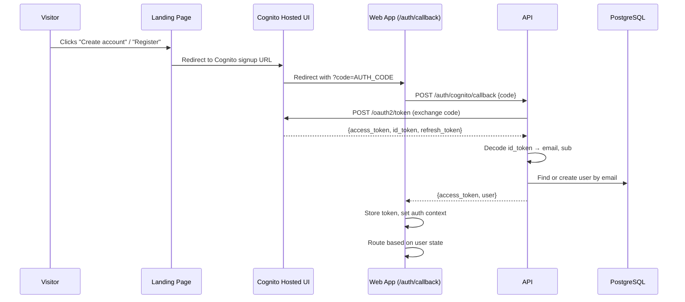
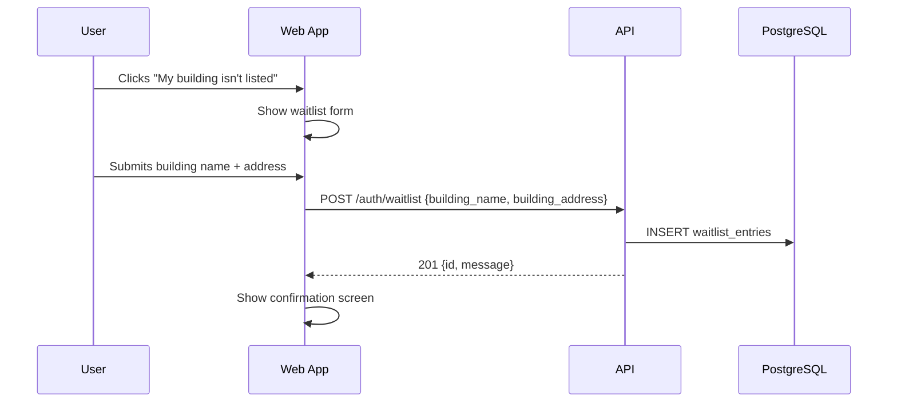

# Design Document: Registration & Waitlist Flow

## Overview

This design replaces the custom email/password registration form in the Web App with a redirect to the Cognito Hosted UI, adds an authorization code exchange flow via the API, provisions local user records after Cognito authentication, routes users through onboarding based on account state, and introduces a waitlist system for buildings not yet active on Bloom.

The flow spans three codebases:
- **Landing Page** (`apps/landing`, Next.js) — CTA buttons redirect to Cognito Hosted UI
- **Web App** (`apps/web`, React + Vite) — callback page, auth context updates, waitlist form
- **API** (`apps/api`, FastAPI) — token exchange endpoint, user provisioning, waitlist CRUD

### Key Design Decisions

1. **Authorization Code Flow (not Implicit)**: Cognito returns an authorization code to the frontend, which sends it to the API. The API exchanges it server-side for tokens. This keeps the client secret off the frontend and follows OAuth 2.0 best practices.

2. **API-mediated token exchange**: The Web App never talks directly to Cognito's token endpoint. The API acts as a confidential client, exchanges the code, extracts user info from the ID token, provisions the local user, and returns a single response with tokens + user object.

3. **Reuse existing auth patterns**: The `AuthProvider`, `OnboardingGuard`, and `setAuthToken`/`getAuthToken` utilities already handle post-login routing. The callback page plugs into these same patterns.

4. **Waitlist as a separate table**: Waitlist entries are not properties. They capture demand signal (building name + address as free text) and are decoupled from the `properties` table.

## Architecture



### Waitlist Flow



## Components and Interfaces

### Landing Page Changes (`apps/landing`)

**Environment variables** (new):
- `NEXT_PUBLIC_COGNITO_DOMAIN` — e.g. `bloom-dev.auth.us-east-1.amazoncognito.com`
- `NEXT_PUBLIC_COGNITO_CLIENT_ID` — e.g. `5j7l03d6avbg43fh0hvvslom2f`
- `NEXT_PUBLIC_COGNITO_REDIRECT_URI` — e.g. `https://app.blooms.now/auth/callback`

**URL construction helper** (`lib/cognito.ts`):
```typescript
export function getCognitoSignupUrl(): string {
  const domain = process.env.NEXT_PUBLIC_COGNITO_DOMAIN;
  const clientId = process.env.NEXT_PUBLIC_COGNITO_CLIENT_ID;
  const redirectUri = process.env.NEXT_PUBLIC_COGNITO_REDIRECT_URI;
  const params = new URLSearchParams({
    client_id: clientId,
    response_type: "code",
    scope: "openid email profile",
    redirect_uri: redirectUri,
  });
  return `https://${domain}/signup?${params.toString()}`;
}
```

**Changes to existing components**:
- `app/page.tsx` — All `href={APP_URL}/onboarding/register` links change to call `getCognitoSignupUrl()`
- `components/navigation.tsx` — "Register" button href changes to Cognito signup URL

### Web App Changes (`apps/web`)

**New route**: `/auth/callback` — `CallbackPage` component
- Extracts `code` query parameter from URL
- Sends code to `POST /auth/cognito/callback`
- On success: stores token via `setAuthToken()`, sets user via `setUser()`, routes based on user state
- On error: displays error message with link to retry

**New route**: `/onboarding/waitlist` — `WaitlistPage` component (or inline in PropertyPage)
- Form with building_name and building_address fields
- Submits to `POST /auth/waitlist`
- Shows confirmation on success

**Modified component**: `PropertyPage.tsx`
- Adds "My building isn't listed" link below the property list
- Navigates to waitlist form (inline or separate route)

**Modified component**: `RegisterPage.tsx`
- Replaced with a redirect to Cognito signup URL (no more custom form)

**New API client functions** (`lib/api.ts`):
```typescript
async function exchangeAuthCode(code: string): Promise<LoginResponse> { ... }
async function submitWaitlistEntry(data: WaitlistRequest): Promise<WaitlistResponse> { ... }
```

### API Changes (`apps/api`)

**New endpoint**: `POST /auth/cognito/callback`
- Request: `{ code: string }`
- Exchanges code with Cognito token endpoint via HTTP POST to `https://{domain}/oauth2/token`
- Decodes ID token to extract `email` and `sub`
- Finds or creates local user (email lookup → create if missing)
- Returns: `{ access_token, user }` (same shape as existing `LoginResponse`)

**New endpoint**: `POST /auth/waitlist`
- Request: `{ building_name: string, building_address: string }`
- Requires authentication (any role, but practically CUSTOMER)
- Creates `waitlist_entries` row
- Returns: `{ id, message: "We'll notify you when your building goes live" }`

**New endpoint**: `GET /admin/waitlist`
- Requires ADMIN role
- Returns paginated list of waitlist entries with user email
- Query params: `page` (default 1), `per_page` (default 20)

**New model**: `WaitlistEntry` (SQLAlchemy ORM)
**New migration**: `013_create_waitlist_entries_table`

### Cognito Token Exchange Details

The API exchanges the authorization code by making an HTTP POST to Cognito's `/oauth2/token` endpoint:

```
POST https://bloom-dev.auth.us-east-1.amazoncognito.com/oauth2/token
Content-Type: application/x-www-form-urlencoded

grant_type=authorization_code
&code={auth_code}
&client_id=5j7l03d6avbg43fh0hvvslom2f
&redirect_uri={redirect_uri}
```

The response contains `access_token`, `id_token`, and `refresh_token`. The `id_token` is a JWT containing `email` and `sub` claims.

**Note**: Since the Cognito app client is configured without a client secret (public client for Hosted UI), no `client_secret` is needed in the token exchange. If a client secret is configured, it would be sent via Basic auth header.

## Data Models

### WaitlistEntry (new table: `waitlist_entries`)

```
WaitlistEntry
├── id                UUID (PK, default gen_random_uuid())
├── user_id           UUID (FK → users.id, NOT NULL)
├── building_name     VARCHAR(255, NOT NULL)
├── building_address  VARCHAR(500, NOT NULL)
├── status            VARCHAR(20, NOT NULL, default 'PENDING')
├── created_at        TIMESTAMPTZ (NOT NULL, default NOW())
```

**SQLAlchemy model** (`models/waitlist.py`):
```python
class WaitlistStatus(str, Enum):
    PENDING = "PENDING"
    CONTACTED = "CONTACTED"
    ACTIVATED = "ACTIVATED"

class WaitlistEntry(Base):
    __tablename__ = "waitlist_entries"
    id = Column(UUID(as_uuid=True), primary_key=True, default=uuid.uuid4)
    user_id = Column(UUID(as_uuid=True), ForeignKey("users.id"), nullable=False)
    building_name = Column(String(255), nullable=False)
    building_address = Column(String(500), nullable=False)
    status = Column(String(20), nullable=False, default="PENDING")
    created_at = Column(DateTime(timezone=True), default=lambda: datetime.now(timezone.utc))
```

### Pydantic Schemas (new)

```python
class WaitlistCreateRequest(BaseModel):
    building_name: str = Field(..., min_length=1, max_length=255)
    building_address: str = Field(..., min_length=1, max_length=500)

class WaitlistCreateResponse(BaseModel):
    id: uuid.UUID
    message: str = "We'll notify you when your building goes live"

class WaitlistEntryResponse(BaseModel):
    id: uuid.UUID
    user_email: str
    building_name: str
    building_address: str
    status: str
    created_at: datetime

class WaitlistListResponse(BaseModel):
    entries: list[WaitlistEntryResponse]
    total: int
    page: int
    per_page: int

class CognitoCallbackRequest(BaseModel):
    code: str

# Reuses existing LoginResponse for the callback response
```

### Alembic Migration (013)

```sql
CREATE TABLE waitlist_entries (
    id UUID PRIMARY KEY DEFAULT gen_random_uuid(),
    user_id UUID NOT NULL REFERENCES users(id) ON DELETE CASCADE,
    building_name VARCHAR(255) NOT NULL,
    building_address VARCHAR(500) NOT NULL,
    status VARCHAR(20) NOT NULL DEFAULT 'PENDING',
    created_at TIMESTAMPTZ NOT NULL DEFAULT NOW()
);

CREATE INDEX ix_waitlist_entries_user_id ON waitlist_entries(user_id);
CREATE INDEX ix_waitlist_entries_created_at ON waitlist_entries(created_at DESC);
```


## Correctness Properties

*A property is a characteristic or behavior that should hold true across all valid executions of a system — essentially, a formal statement about what the system should do. Properties serve as the bridge between human-readable specifications and machine-verifiable correctness guarantees.*

### Property 1: Cognito URL contains all required OAuth parameters

*For any* valid Cognito configuration (domain, client_id, redirect_uri), the generated signup URL must contain query parameters `client_id`, `redirect_uri`, `response_type=code`, and `scope=openid email profile`, and the URL host must match the configured Cognito domain.

**Validates: Requirements 1.1, 1.3**

### Property 2: Token exchange request is well-formed

*For any* valid authorization code and Cognito configuration, the HTTP request constructed for Cognito's `/oauth2/token` endpoint must include `grant_type=authorization_code`, the provided `code`, the configured `client_id`, and the configured `redirect_uri` in the form-encoded body.

**Validates: Requirements 2.3**

### Property 3: ID token claim extraction round trip

*For any* JWT ID token containing `email` and `sub` claims, decoding the token and extracting those claims must return the original email and sub values.

**Validates: Requirements 2.4**

### Property 4: User find-or-create is idempotent

*For any* email and Cognito sub, calling the user provisioning function twice with the same email must result in exactly one user record in the database, and both calls must return a user object with matching `id`, `email`, `role=CUSTOMER`, and `subscription_status=CREATED`. The response must include an `access_token` and a `user` object containing `property_id` and `subscription_status`.

**Validates: Requirements 3.1, 3.2, 3.3**

### Property 5: Post-authentication routing is deterministic

*For any* authenticated user with role CUSTOMER: if `property_id` is null, the routing function returns `/onboarding/property`; if `property_id` is set and `subscription_status` is `CREATED`, it returns `/onboarding/subscription`; if `subscription_status` is `ACTIVE` or `PAUSED`, it returns `/customer`. These three cases are exhaustive and mutually exclusive for CUSTOMER users.

**Validates: Requirements 4.1, 4.2, 4.3**

### Property 6: Waitlist input validation respects length bounds

*For any* string `building_name` with length in [1, 255] and `building_address` with length in [1, 500], the waitlist submission must be accepted. *For any* `building_name` that is empty or longer than 255 characters, or `building_address` that is empty or longer than 500 characters, the submission must be rejected.

**Validates: Requirements 5.3**

### Property 7: Waitlist creation round trip

*For any* authenticated user and valid waitlist submission (building_name, building_address), creating a waitlist entry and then reading it back from the database must return a record with matching `user_id`, `building_name`, `building_address`, `status=PENDING`, and a non-null `created_at` timestamp. The API response must include the entry `id` and a confirmation message.

**Validates: Requirements 5.4, 5.5, 6.4**

### Property 8: Users can have multiple waitlist entries

*For any* authenticated user with N existing waitlist entries (N >= 0), submitting a new valid waitlist entry must result in N+1 total waitlist entries for that user, and the new entry must be distinct from all previous entries.

**Validates: Requirements 5.7**

### Property 9: Admin waitlist list is ordered and complete

*For any* set of waitlist entries in the database, the admin list endpoint must return them ordered by `created_at` descending, and each entry in the response must include `user_email`, `building_name`, `building_address`, `status`, and `created_at`.

**Validates: Requirements 7.1, 7.2**


## Error Handling

All errors follow the existing Bloom API error response format:

```json
{
  "error": {
    "code": "ERROR_CODE",
    "message": "Human-readable message",
    "request_id": "uuid"
  }
}
```

### Cognito Callback Errors

| Scenario | HTTP Status | Error Code | Message |
|----------|-------------|------------|---------|
| Missing `code` parameter | 400 | `MISSING_AUTH_CODE` | Authorization code is required |
| Invalid or expired code | 401 | `INVALID_AUTH_CODE` | Authorization code is invalid or expired |
| Cognito token endpoint unreachable | 502 | `COGNITO_UNAVAILABLE` | Authentication service temporarily unavailable |
| ID token missing required claims | 500 | `INVALID_ID_TOKEN` | Failed to extract user information from token |

### Waitlist Errors

| Scenario | HTTP Status | Error Code | Message |
|----------|-------------|------------|---------|
| Empty or too-long building_name | 422 | Pydantic validation | Handled by FastAPI request validation |
| Empty or too-long building_address | 422 | Pydantic validation | Handled by FastAPI request validation |
| Unauthenticated request | 401 | `UNAUTHORIZED` | Authentication required |
| Database write failure | 500 | `INTERNAL_ERROR` | Failed to create waitlist entry |

### Admin Waitlist Errors

| Scenario | HTTP Status | Error Code | Message |
|----------|-------------|------------|---------|
| Non-ADMIN role | 403 | `FORBIDDEN` | Admin access required |
| Invalid pagination params | 422 | Pydantic validation | Handled by FastAPI query validation |

### Frontend Error Handling

- **Callback page**: If the code exchange fails, display an error message with a "Try again" button that redirects back to the Cognito signup URL.
- **Waitlist form**: Display inline validation errors for field length. Show a toast/banner for API errors.
- **Network errors**: The existing `apiRequest` function in `lib/api.ts` already handles network errors and token expiration.


## Testing Strategy

### Dual Testing Approach

This feature uses both unit tests and property-based tests for comprehensive coverage.

- **Unit tests**: Verify specific examples, edge cases, integration points, and error conditions
- **Property tests**: Verify universal properties across randomly generated inputs

### Property-Based Testing

**Library**: `hypothesis` (Python, already in use — see `.hypothesis/` directory in repo root)
**Frontend**: `fast-check` (TypeScript, for the URL builder and routing logic)

**Configuration**:
- Minimum 100 iterations per property test (`@settings(max_examples=100)` for Hypothesis, `fc.assert` with `numRuns: 100` for fast-check)
- Each test tagged with a comment referencing the design property

**Tag format**: `Feature: registration-waitlist-flow, Property {number}: {property_text}`

### Property Test Plan

| Property | Layer | Library | What to Generate |
|----------|-------|---------|-----------------|
| 1: Cognito URL params | Frontend | fast-check | Random domain strings, client IDs, redirect URIs |
| 2: Token exchange request | Backend | hypothesis | Random auth codes, Cognito config values |
| 3: ID token claim extraction | Backend | hypothesis | Random email/sub pairs encoded as JWTs |
| 4: User find-or-create idempotence | Backend | hypothesis | Random emails and UUIDs, called twice |
| 5: Post-auth routing | Frontend | fast-check | Random user objects with varying property_id and subscription_status |
| 6: Waitlist input validation | Backend | hypothesis | Random strings of varying lengths (0–600 chars) |
| 7: Waitlist creation round trip | Backend | hypothesis | Random building names and addresses within valid bounds |
| 8: Multiple waitlist entries | Backend | hypothesis | Random user + random number of prior entries (0–5) |
| 9: Admin waitlist ordering | Backend | hypothesis | Random sets of waitlist entries with varying timestamps |

### Unit Test Plan

| Area | Tests |
|------|-------|
| Cognito callback — happy path | Exchange valid code → returns token + user |
| Cognito callback — invalid code | Returns 401 with INVALID_AUTH_CODE |
| Cognito callback — existing user | Returns existing user, no duplicate created |
| Waitlist creation — happy path | Valid submission → 201 with entry ID |
| Waitlist creation — unauthenticated | Returns 401 |
| Admin waitlist — ADMIN role | Returns paginated list |
| Admin waitlist — non-ADMIN role | Returns 403 |
| Callback page — renders loading then redirects | Component test |
| Waitlist form — validates required fields | Component test |
| RegisterPage — redirects to Cognito | No longer renders form |
| Landing page — CTA href points to Cognito | Link target test |

### Test File Locations

- Backend property tests: `apps/api/tests/properties/test_registration_waitlist.py`
- Backend unit tests: `apps/api/tests/test_cognito_callback.py`, `apps/api/tests/test_waitlist.py`
- Frontend property tests: `apps/web/src/__tests__/registration-waitlist-properties.test.ts`
- Frontend unit tests: `apps/web/src/__tests__/callback-page.test.tsx`, `apps/web/src/__tests__/waitlist-form.test.tsx`
