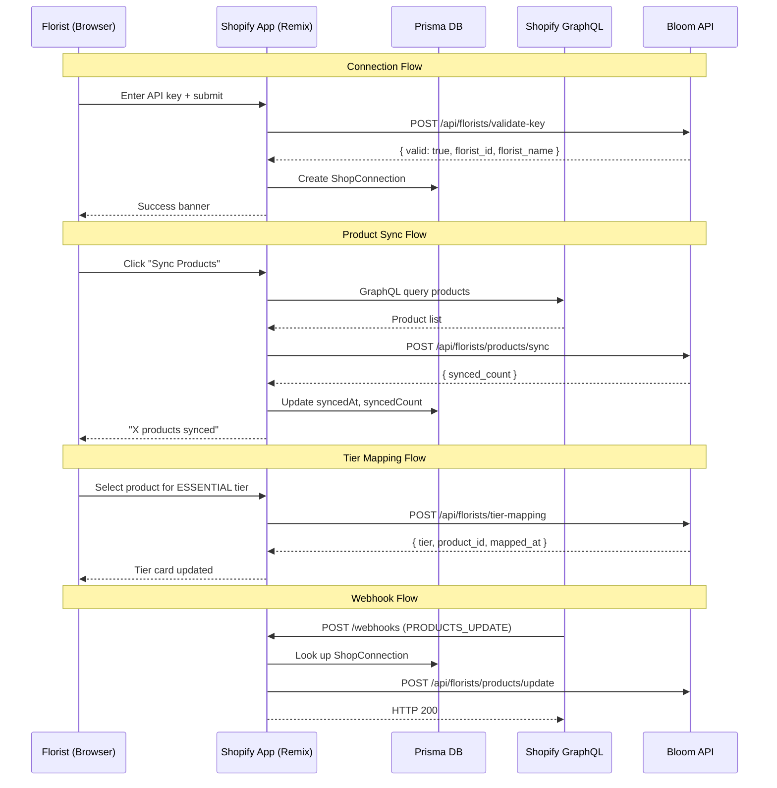

# Design Document: Shopify App

## Overview

The Bloom Shopify App is an embedded Remix application that runs inside a florist's Shopify admin. It bridges the florist's Shopify store (product catalog, pricing, inventory) with the Bloom backend API (orchestration, deliveries, tier assignments). The app handles OAuth authentication (already working), product catalog synchronization, tier mapping, webhook processing, and a guided onboarding flow.

The existing scaffold at `apps/shopify/` provides the foundation: Remix + Vite, Shopify CLI integration, Prisma session storage (SQLite for dev), OAuth flow, basic route stubs, and Polaris UI. This design builds on that scaffold to deliver the complete MLP functionality.

### Key Design Decisions

1. **Prisma as local data store**: The Shopify app's SQLite/Prisma database stores session data and shop connection state. Product data and tier mappings live in the Bloom API (source of truth for orchestration).
2. **Bloom API as orchestration layer**: All product sync and tier mapping data flows through the Bloom API. The Shopify app is a thin client that reads from Shopify and writes to Bloom.
3. **Server-side data fetching**: All Shopify GraphQL and Bloom API calls happen in Remix loaders/actions (server-side), keeping API keys and tokens secure.
4. **Polaris UI**: All UI components use Shopify's Polaris design system for a native embedded app experience.

## Architecture

```mermaid
graph TB
    subgraph "Shopify Admin (Browser)"
        UI[Polaris UI - Embedded App]
    end

    subgraph "Shopify App Server (Remix)"
        Routes[Remix Routes<br/>loaders + actions]
        BloomClient[Bloom API Client<br/>bloom-api.server.ts]
        ShopifyAuth[Shopify Auth<br/>shopify.server.ts]
        Prisma[Prisma ORM<br/>Session + ShopConnection]
    end

    subgraph "External Services"
        ShopifyGQL[Shopify GraphQL API]
        ShopifyWebhooks[Shopify Webhook Events]
        BloomAPI[Bloom FastAPI Backend]
    end

    subgraph "Bloom Backend"
        FloristEndpoints[/florist/* endpoints]
        ProductEndpoints[/api/florists/products/*]
        DB[(PostgreSQL RDS)]
    end

    UI -->|HTTP| Routes
    Routes --> BloomClient
    Routes --> ShopifyAuth
    Routes --> Prisma
    ShopifyAuth -->|GraphQL| ShopifyGQL
    BloomClient -->|REST + API Key| BloomAPI
    ShopifyWebhooks -->|POST| Routes
    BloomAPI --> FloristEndpoints
    BloomAPI --> ProductEndpoints
    FloristEndpoints --> DB
    ProductEndpoints --> DB
```

### Request Flow

1. Florist opens app in Shopify admin → Shopify loads embedded iframe → Remix serves the route
2. Remix loader authenticates via `shopify.server.ts`, fetches data from Shopify GraphQL and/or Bloom API
3. UI renders with Polaris components using loader data
4. Florist actions (connect, sync, map tier) trigger Remix form actions
5. Actions call Bloom API client, update Prisma records, return results to UI
6. Webhooks arrive at `/webhooks` route, are authenticated by Shopify library, and forwarded to Bloom API

## Components and Interfaces

### 1. Bloom API Client (`app/services/bloom-api.server.ts`)

The existing stub is expanded into a full client with typed request/response handling.

```typescript
// Core interface for the Bloom API client
interface BloomApiClient {
  // Connection management
  validateApiKey(apiKey: string): Promise<{ valid: boolean; florist_id?: string; florist_name?: string }>;
  getConnectionStatus(shopDomain: string): Promise<BloomFloristConnection | null>;
  notifyDisconnection(shopDomain: string): Promise<boolean>;

  // Product sync
  syncProducts(apiKey: string, shopDomain: string, products: BloomProduct[]): Promise<SyncResult>;
  getFloristProducts(apiKey: string): Promise<BloomProduct[]>;

  // Tier mapping
  getTierMappings(apiKey: string): Promise<TierMapping[]>;
  setTierMapping(apiKey: string, tier: BloomTier, shopifyProductId: string): Promise<TierMapping>;
  removeTierMapping(apiKey: string, tier: BloomTier): Promise<boolean>;

  // Florist status
  setFloristReady(apiKey: string): Promise<boolean>;
  getFloristDashboard(apiKey: string): Promise<FloristDashboardData>;

  // Webhook forwarding
  notifyProductUpdate(apiKey: string, shopDomain: string, product: BloomProduct): Promise<boolean>;
  notifyProductDeletion(apiKey: string, shopDomain: string, shopifyProductId: string): Promise<boolean>;
}

type BloomTier = "ESSENTIAL" | "SIGNATURE" | "STATEMENT";

interface BloomProduct {
  shopify_product_id: string;
  shopify_variant_id: string;
  title: string;
  price: string;
  image_url: string | null;
  inventory_quantity: number;
  status: string;
}

interface SyncResult {
  success: boolean;
  synced: number;
  failed: number;
  errors: string[];
}

interface TierMapping {
  tier: BloomTier;
  shopify_product_id: string;
  product_title: string;
  product_price: string;
  mapped_at: string;
}

interface FloristDashboardData {
  florist_id: string;
  florist_name: string;
  florist_status: string;
  synced_product_count: number;
  mapped_tiers: TierMapping[];
  pending_delivery_count: number;
  last_sync_at: string | null;
}
```

All methods follow a consistent pattern:
- Authenticate with `X-API-Key` header
- Parse error responses into the Bloom error envelope format `{ error: { code, message } }`
- Throw typed `BloomApiError` on failure for consistent error handling in routes

### 2. Prisma Schema Extensions (`prisma/schema.prisma`)

The existing `ShopConnection` model is extended to store connection metadata:

```prisma
model ShopConnection {
  id          String    @id @default(cuid())
  shop        String    @unique
  bloomApiKey String    // Encrypted Bloom API key
  floristId   String?   // Bloom florist ID once validated
  floristName String?   // Cached florist name for display
  syncedAt    DateTime? // Last successful product sync
  syncedCount Int       @default(0) // Number of products last synced
  createdAt   DateTime  @default(now())
  updatedAt   DateTime  @updatedAt
}
```

### 3. Route Structure

| Route | Purpose | Loader | Action |
|-------|---------|--------|--------|
| `app._index.tsx` | Dashboard home | Load ShopConnection + dashboard data from Bloom API | — |
| `app.products.tsx` | Product list + tier mapping | Load Shopify products + Bloom tier mappings | Sync products, set/remove tier mappings |
| `app.settings.tsx` | Connection management | Load ShopConnection status | Connect (validate key + create record), disconnect |
| `webhooks.tsx` | Webhook handler | — | Process PRODUCTS_UPDATE, PRODUCTS_DELETE, APP_UNINSTALLED |

### 4. Onboarding State Machine

The onboarding flow is derived from the ShopConnection state rather than stored separately:

```typescript
interface OnboardingState {
  step1_linkStore: boolean;    // ShopConnection exists with valid floristId
  step2_linkProducts: boolean; // At least one tier mapping exists
  step3_deliveries: boolean;   // Florist status is READY
  isComplete: boolean;         // All three steps done
}

function deriveOnboardingState(
  connection: ShopConnection | null,
  tierMappings: TierMapping[],
  floristStatus: string | null
): OnboardingState {
  const step1 = connection !== null && connection.floristId !== null;
  const step2 = step1 && tierMappings.length > 0;
  const step3 = step2 && floristStatus === "READY";
  return {
    step1_linkStore: step1,
    step2_linkProducts: step2,
    step3_deliveries: step3,
    isComplete: step1 && step2 && step3,
  };
}
```

This is a pure function — no side effects, no stored state. The onboarding UI simply renders based on the derived state.

### 5. Webhook Handler (`app/routes/webhooks.tsx`)

```typescript
// Webhook processing flow
// 1. Shopify library authenticates HMAC signature (built into shopify-app-remix)
// 2. Look up ShopConnection for the shop domain
// 3. If connection exists and has API key, forward event to Bloom API
// 4. Always return 200 to Shopify (even on internal errors) to prevent retries

interface WebhookContext {
  topic: string;
  shop: string;
  payload: unknown;
  apiKey: string | null; // From ShopConnection, null if not connected
}
```

### 6. UI Components

All UI is built with Polaris components. Key composite components:

| Component | Location | Purpose |
|-----------|----------|---------|
| `OnboardingBanner` | `app._index.tsx` | Shows onboarding progress when incomplete |
| `DashboardCards` | `app._index.tsx` | Connection status, sync stats, delivery count |
| `ProductList` | `app.products.tsx` | Shopify products with sync button |
| `TierMappingCard` | `app.products.tsx` | One card per tier with product selector dropdown |
| `ConnectionForm` | `app.settings.tsx` | API key input + connect/disconnect buttons |
| `ConnectionStatus` | `app.settings.tsx` | Current connection details sidebar |

These are inline within route files (not separate component files) to keep the codebase simple per MLP principles.

## Data Models

### ShopConnection (Prisma - Shopify App DB)

| Field | Type | Description |
|-------|------|-------------|
| id | String (cuid) | Primary key |
| shop | String (unique) | Shopify store domain (e.g., `store.myshopify.com`) |
| bloomApiKey | String | Bloom API key for authenticating requests |
| floristId | String? | Bloom florist UUID, set after successful validation |
| floristName | String? | Cached florist display name |
| syncedAt | DateTime? | Timestamp of last successful product sync |
| syncedCount | Int | Number of products in last sync |
| createdAt | DateTime | Record creation timestamp |
| updatedAt | DateTime | Last update timestamp |

### BloomProduct (API payload - not persisted in Shopify app)

| Field | Type | Description |
|-------|------|-------------|
| shopify_product_id | String | Shopify product GID |
| shopify_variant_id | String | Shopify variant GID (first variant) |
| title | String | Product title |
| price | String | Variant price as string |
| image_url | String? | Featured image URL |
| inventory_quantity | Number | Current inventory level |
| status | String | Shopify product status (ACTIVE, DRAFT, ARCHIVED) |

### TierMapping (API payload - persisted in Bloom API)

| Field | Type | Description |
|-------|------|-------------|
| tier | BloomTier | ESSENTIAL, SIGNATURE, or STATEMENT |
| shopify_product_id | String | Mapped Shopify product GID |
| product_title | String | Product title for display |
| product_price | String | Product price for display |
| mapped_at | String | ISO timestamp of when mapping was created |

### OnboardingState (Derived - not persisted)

| Field | Type | Description |
|-------|------|-------------|
| step1_linkStore | Boolean | Whether ShopConnection exists with valid floristId |
| step2_linkProducts | Boolean | Whether at least one tier mapping exists |
| step3_deliveries | Boolean | Whether florist status is READY |
| isComplete | Boolean | All three steps complete |

### Data Flow Diagram




## Correctness Properties

*A property is a characteristic or behavior that should hold true across all valid executions of a system — essentially, a formal statement about what the system should do. Properties serve as the bridge between human-readable specifications and machine-verifiable correctness guarantees.*

The following properties are derived from the acceptance criteria in the requirements document. Each property is universally quantified and suitable for property-based testing.

### Property 1: Connection round-trip

*For any* valid Bloom API key and shop domain, connecting to Bloom (creating a ShopConnection with a validated floristId) and then disconnecting (removing the ShopConnection) should result in no ShopConnection existing for that shop domain.

**Validates: Requirements 1.1, 1.4**

### Property 2: Invalid API key rejection

*For any* string that is empty or composed entirely of whitespace, attempting to connect to Bloom should be rejected without creating a ShopConnection record, and the action should return an error response.

**Validates: Requirements 1.2**

### Property 3: Product transformation completeness

*For any* Shopify product GraphQL response containing an id, title, featuredImage, variants, and status, the transformed BloomProduct object should contain non-null values for shopify_product_id, shopify_variant_id, title, price, and status fields. The image_url field should be present (possibly null if no image exists).

**Validates: Requirements 2.5, 7.4**

### Property 4: Sync result integrity

*For any* list of products submitted for sync, the SyncResult should satisfy: `synced + failed == total_submitted`, and the ShopConnection's syncedCount should equal the SyncResult's synced count, and syncedAt should be updated to a timestamp no earlier than the sync start time.

**Validates: Requirements 2.2, 2.3**

### Property 5: Onboarding state derivation invariant

*For any* combination of ShopConnection (present or null), tier mappings list (empty or non-empty), and florist status (any value), the derived OnboardingState must satisfy: (1) if step1_linkStore is false, then step2_linkProducts and step3_deliveries must also be false; (2) if step2_linkProducts is false, then step3_deliveries must be false; (3) isComplete must equal (step1_linkStore AND step2_linkProducts AND step3_deliveries).

**Validates: Requirements 5.2, 5.3, 5.5, 5.6**

### Property 6: Tier mapping idempotence

*For any* tier and product, setting the same tier mapping twice in succession should produce the same final state as setting it once. The tier should be mapped to the specified product after both operations.

**Validates: Requirements 3.3**

### Property 7: Webhook product update transformation

*For any* valid Shopify PRODUCTS_UPDATE webhook payload, the transformed product data forwarded to the Bloom API should contain the updated title, price, image URL, and inventory quantity matching the webhook payload values.

**Validates: Requirements 4.1**

### Property 8: Invalid webhook graceful handling

*For any* webhook payload that fails validation (missing required fields, malformed data), the webhook handler should return an HTTP 200 status code and not throw an unhandled exception.

**Validates: Requirements 4.4**

### Property 9: API key header authentication

*For any* Bloom API client method call with a provided API key, the outgoing HTTP request must include an `X-API-Key` header whose value equals the provided API key.

**Validates: Requirements 7.1**

### Property 10: API response deserialization

*For any* Bloom API response body conforming to the error envelope format `{ error: { code: string, message: string } }`, the client should extract and return the error message. *For any* valid success response body, the client should parse it into the expected typed structure without data loss.

**Validates: Requirements 7.2, 7.5**

## Error Handling

### Bloom API Errors

All Bloom API calls go through the `bloom-api.server.ts` client, which handles errors consistently:

| Error Type | Handling | User-Facing Message |
|------------|----------|---------------------|
| Network error (fetch fails) | Catch, return `BloomApiError` with `NETWORK_ERROR` code | "Unable to reach Bloom. Please try again." |
| HTTP 401 (invalid API key) | Parse error envelope, return `BloomApiError` | "Invalid API key. Please check your key in the Bloom dashboard." |
| HTTP 4xx (client error) | Parse error envelope, return `BloomApiError` with Bloom's message | Display Bloom's error message directly |
| HTTP 5xx (server error) | Parse error envelope, return `BloomApiError` | "Bloom is experiencing issues. Please try again later." |
| JSON parse failure | Catch, return `BloomApiError` with `PARSE_ERROR` code | "Unexpected response from Bloom. Please try again." |

```typescript
class BloomApiError extends Error {
  constructor(
    public code: string,
    message: string,
    public statusCode?: number
  ) {
    super(message);
    this.name = "BloomApiError";
  }
}
```

### Shopify API Errors

Shopify GraphQL errors are handled in route loaders:

| Error Type | Handling |
|------------|----------|
| GraphQL errors | Extract error messages from response, display in banner |
| Rate limiting (429) | Display "Please wait and try again" message |
| Auth failure | Redirect to Shopify OAuth re-auth flow (handled by shopify-app-remix) |

### Webhook Errors

Webhooks always return HTTP 200 to Shopify to prevent retries. Errors are logged:

```typescript
// In webhooks.tsx action
try {
  // Process webhook
} catch (error) {
  console.error(`Webhook processing failed: ${topic} from ${shop}`, error);
  // Still return 200 to prevent Shopify retries
}
return new Response(null, { status: 200 });
```

### Prisma Errors

| Error Type | Handling |
|------------|----------|
| Unique constraint (duplicate shop) | Return existing connection or update |
| Connection not found | Return null, let route handle missing state |
| Database connection failure | Log error, return 500 with generic message |

## Testing Strategy

### Testing Framework

- **Unit tests**: Vitest (already configured in the Shopify app scaffold)
- **Property-based tests**: fast-check (JavaScript PBT library, integrates with Vitest)
- **Mocking**: Vitest mocks for Bloom API client and Prisma

### Test Organization

```
apps/shopify/
  app/
    services/
      __tests__/
        bloom-api.server.test.ts    # Bloom API client unit + property tests
    routes/
      __tests__/
        onboarding.test.ts          # Onboarding state derivation property tests
        products.test.ts            # Product transformation property tests
        webhooks.test.ts            # Webhook handler tests
```

### Property-Based Tests

Each correctness property maps to a single property-based test using fast-check. Minimum 100 iterations per test.

| Property | Test File | Generator Strategy |
|----------|-----------|-------------------|
| P1: Connection round-trip | bloom-api.server.test.ts | Generate random shop domains + API keys |
| P2: Invalid key rejection | bloom-api.server.test.ts | Generate whitespace/empty strings |
| P3: Product transformation | products.test.ts | Generate random Shopify GraphQL product shapes |
| P4: Sync result integrity | bloom-api.server.test.ts | Generate random product lists + partial failure scenarios |
| P5: Onboarding state invariant | onboarding.test.ts | Generate random combinations of connection/mappings/status |
| P6: Tier mapping idempotence | products.test.ts | Generate random tier + product pairs |
| P7: Webhook product transformation | webhooks.test.ts | Generate random Shopify webhook payloads |
| P8: Invalid webhook handling | webhooks.test.ts | Generate malformed webhook payloads |
| P9: API key header | bloom-api.server.test.ts | Generate random API keys, verify header |
| P10: Response deserialization | bloom-api.server.test.ts | Generate random error envelopes + success responses |

### Unit Tests

Unit tests cover specific examples and edge cases not suited for property testing:

- Connection form with existing connection (example, Req 1.3)
- Network error during connection (example, Req 1.5)
- Tier mapping with same product on multiple tiers (example, Req 3.5)
- APP_UNINSTALLED webhook cleanup (example, Req 4.3)
- PRODUCTS_DELETE webhook forwarding (example, Req 4.2)
- First-time app open shows onboarding (example, Req 5.1)
- Activate deliveries calls setFloristReady (example, Req 5.4)
- Bloom API unreachable retry (example, Req 7.3)

### Test Configuration

```typescript
// vitest.config.ts additions
export default defineConfig({
  test: {
    // fast-check default: 100 iterations per property
    // Can override per-test with fc.assert(property, { numRuns: 200 })
  },
});
```

Each property test is tagged with a comment:
```typescript
// Feature: shopify-app, Property 5: Onboarding state derivation invariant
// Validates: Requirements 5.2, 5.3, 5.5, 5.6
```
